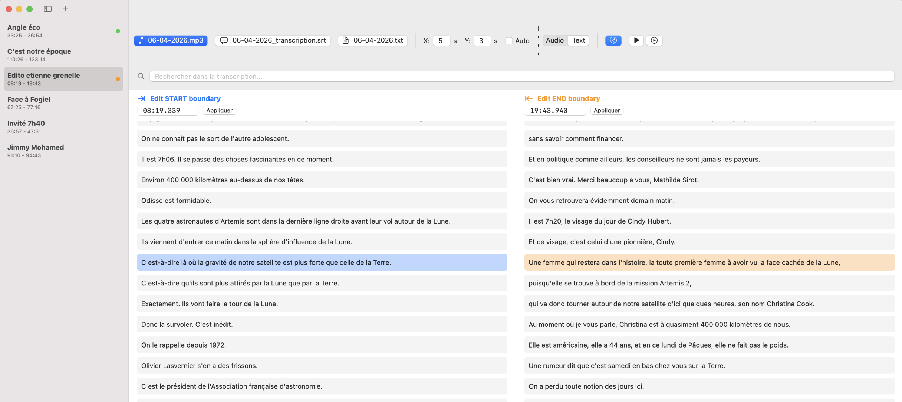

## Création du dataset
Pour réaliser le dataset, il faut mettre en correspondance des émissions de radio (transcription ou audio) ainsi que les timecodes des chroniques dans chaque émission.

### Données audio

#### Téléchargement manuel et étiquetage à la main

Dans un premier temps, les émissions de radio étaient téléchargés à la main depuis les différents sites web de radio et les chroniques étaient détectés à la main de manière humaine, dans un fichier texte indiquant le nom de la chronique ainsi que le timecode de début et le timecode de fin.

#### Téléchargement manuel, étiquetage via LLM et vérification humaine
La détection des chroniques entièrement humaine a ensuite été remplacée par une détection via un LLM (gemini en cli) qui créait les fichiers texte avec les timecodes des chroniques.  
Une vérification humaine était ensuite appliquée via une interface Swift macOS.

*Visualisation de la phrase du début de la chronique et celle de fin*

*Édition manuelle de la phrase de début et de fin*

#### Téléchargement et détection automatique
La technique actuellement utilisée est 100% automatique et ne nécessite aucune intervention humaine.
- **Téléchargement des émissions** : Le téléchargement des émissions et des chroniques la composant est entièrement fait automatiquement par un programme Python. Cependant, le programme n'arrive pas à récupérer certaines chroniques, donc l'intégralité des chroniques n'est pas téléchargée.
- **Détection des chroniques** : Un second programme analyse l'audio complet et retrouve les chroniques dans cet audio pour en déduire la position des chroniques dans l'audio et créer le fichier texte qui renseigne la position des chroniques dans l'audio.
- **Ajustement du fichier audio** : Comme certaines chroniques manquent, il ne faut pas les étiquetter comme 'non chronique'. Un troisième programme déduit la liste des chroniques manquantes à partir de la liste théorique des chroniques présentes dans l'émission, enlève les parties avec les chroniques manquantes de l'audio et ajuste le fichier texte en prenant en compte le nouvel audio et les chroniques manquantes.

