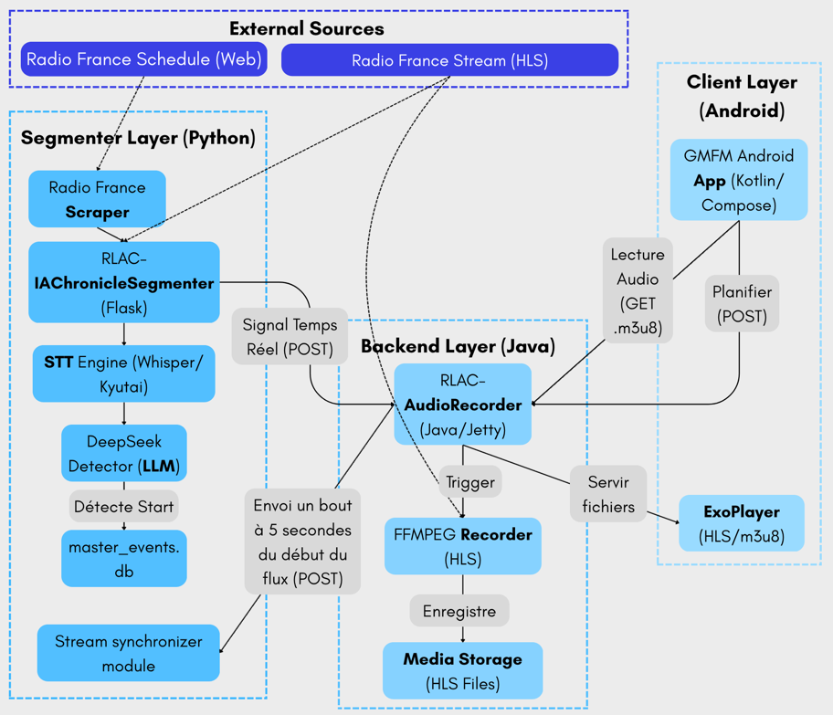
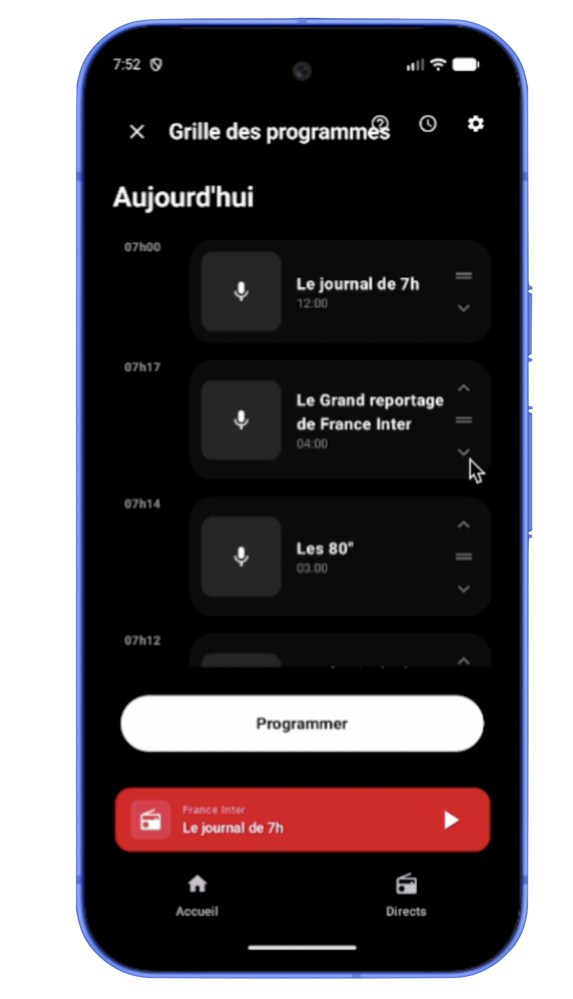

---
---

# Introduction to GroovyMorning: Real-Time Radio Stream Personalization

This series of articles documents the technical challenges and architectural solutions implemented to ensure the automated capture, analysis, and distribution of radio segments.

## The Pillars of the System

To go from a raw audio signal to a functional mobile application, GroovyMorning relies on the following five pillars:

1.  **Capture (RLAC-AudioRecorder)**: A high-availability Java module ensuring continuous recording and HLS segmentation.
2.  **Intelligence (IAChronicleDetector)**: A Python analysis engine using artificial intelligence to identify various radio segments in real-time.
3.  **Synchronization**: A temporal correction and fingerprinting mechanism to align distributed streams.
4.  **Data Infrastructure**: A dataset creation pipeline for model training and evaluation.

5. **Mobile Application**: A mobile application allowing users to **customize the radio grid** and listen to it.

---

## Structure of the Technical Series

The series is structured into eleven chapters, each addressing a specific aspect of the processing pipeline.

### 1. AI-Powered Chronicle Detection
Analysis of different identification methods (LLM, Machine Learning, Spectral Analysis) and the implementation of a JSON interoperability standard for detectors.
[Access the article](./1.ai-chronicle-detection.md)

### 2. Audio Recalibration and Synchronization
Management of latency between the detection server (Python) and the recording server (Java). Use of physical links (hard links) for retroactive correction without disk overhead.
[Access the article](./2.audio-recalibration.md)

### 3. Quality Evaluation Framework
Implementation of a benchmarking system to measure the accuracy of segmentation models and their ability to meet real-time constraints.
[Access the article](./3.quality-evaluation.md)

### 4. Latency Calculation and Master Sync
Use of audio fingerprinting to calculate and compensate for the offset between two distant HTTP streams.
[Access the article](./4.latency-calculation.md)

### 5. Transcription and Semantic Analysis
Implementation of STT (Speech-To-Text) pipelines with Whisper and Kyutai. Semantic analysis via DeepSeek to extract meaning from radio transitions.
[Access the article](./5.semantic-transcription-solution.md)

### 6. Global Pipeline Architecture
Overview of system orchestration. Logical diagram of data flow between capture, the AI engine, and the distribution API.
[Access the article](./6.global-architecture.md)

### 7. High-Availability Audio Capture
Focus on the Java/Spring Boot module. Management of FFmpeg, capture threads, and the "Master Stream" concept to allow dynamic rewinding.
[Access the article](./7.java-audio-capture.md)

### 8. End-to-End Test Validation
Simulation of a live radio stream via Docker and Unix pipes to validate the complete processing chain without depending on real broadcasting.
[Access the article](./8.e2e-tests-simulation.md)

### 9. Dataset Creation and Ground Truth
Methodology for mathematical alignment between official podcasts and the live stream to automatically generate labeled training data.
[Access the article](./9.ai-data-creation.md)

### 10. Model Hub and Datasets
Using Hugging Face to centralize, version, and distribute the project's AI models and datasets.
[Access the article](./10.hugging-face-hub.md)

### 11. Monitoring with WandB
Tracking training experiments and visualizing performance metrics in real-time via Weights & Biases.
[Access the article](./11.wandb-monitoring.md)

[French version](../fr/0.introduction-generale.md)
