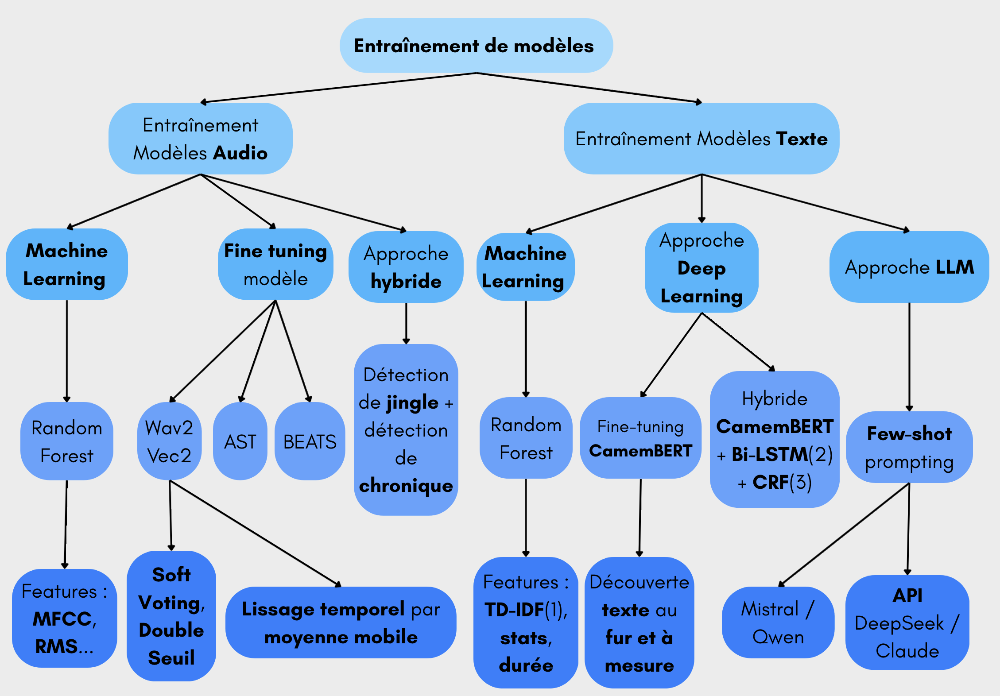
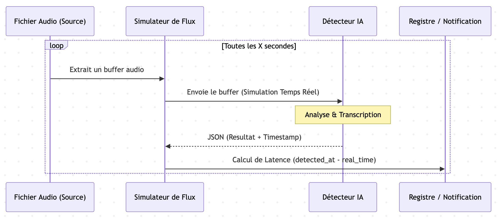

---
---

# AI Radio Chronicle Detection

In the project, one of the major challenges is the automatic identification of the beginning and end of radio chronicles (e.g., "France Inter's 7/10") within an uninterrupted audio stream.

## A Multi-modal Approach

Rather than relying on a single method, a research and development (R&D) framework was developed to find the best method:

1.  **LLM Approaches (Large Language Models)**: Using models like **DeepSeek** or **Claude**. The audio is first transcribed, and then the text is sent to the AI to spot semantic start and end cues. This is the most semantically accurate method, although it introduces latency due to processing.
2.  **Classic Machine Learning**: Using **Random Forest** or **Hybrid** models based on transcription vectors. These models are trained to recognize the textual signature of a radio transition.
3.  **Native Audio Analysis**: Detection based on pre-trained models that directly analyze the audio spectrum to identify jingles or speaker changes.
4.  **Transformers**: Exploration of attention models to capture long-term temporal dependencies in broadcasts.



To see the process in more detail:  
[Detection via audio](ia-models-training/audio/article-audio-training.md) or [detection via text](ia-models-training/text/article-text-training.md)

## The Interoperability Standard

To allow these methods to coexist, a standardized JSON output format was imposed. Each detector must provide:
```json
[
  {
    "label": "7am News",     // chronicle name
    "start": 120.5,           // Start of the chronicle (in seconds)
    "end": 240.0,             // End of the chronicle (in seconds)
    "detected_at": 135.2,     // Precise moment of confirmation by the AI
    "confidence": 0.95        // Model confidence index
  }
]
```

This format also allows for **evaluating these methods**, detailed in [this article](3.quality-evaluation.md).

## "Live" Simulation

Since detection is done in real-time, a **stream simulator** is required. Instead of processing a static audio file, the audio is cut into buffers of a few seconds to simulate real-time reception. This allows for measuring not only the precision of the AI but also its **responsiveness** (latency), a crucial factor for an "instant" radio-on-demand service.

This architecture allows GroovyMorning to remain agnostic towards AI models: the integration of a new cutting-edge model is facilitated by adhering to this standard interface.



## Selected Solution: Live Transcription and Use of the DeepSeek Paid API

### Usage

The DeepSeek API (deepseek-v4-flash) is called to detect phrases corresponding to the start of chronicles, from a list of chronicles to be detected (provided in order). The text is analyzed as it arrives, simulating a live stream.
Few-shot prompting is used to provide examples directly in the prompt (examples of chronicle start phrases).  
Once the LLM detects a chronicle start in the stream, it notifies the recording module via HTTP of the start of the chronicle.

### Gross Error Management

To avoid gross errors, chronicles are compared with their theoretical schedule. A detected chronicle whose schedule has already passed is ignored. 

The solution is more detailed in [this article](5.semantic-transcription-solution.md).

[French version](../fr/1.detection-chroniques.md)
