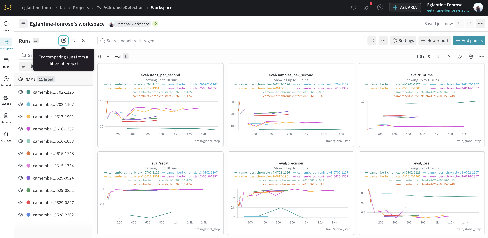

# Experiment Tracking and Monitoring with Weights & Biases (WandB)

Training artificial intelligence models is an iterative process requiring detailed metric analysis. To ensure transparency and reproducibility of results, **GroovyMorning** uses **Weights & Biases (WandB)** as a centralized monitoring platform.

## Why WandB?

As part of the R&D on chronicle detection, we test dozens of configurations daily (hyperparameters, model architectures, dataset sizes). WandB allows us to:

1.  **Visualize in Real-Time**: Track the evolution of `Loss`, `Precision`, `Recall`, and `F1-Score` during training.
2.  **Compare Runs**: Overlay curves from different experiments to instantly identify which model converges best.
3.  **Debug Training**: Quickly identify issues with overfitting or unstable gradients.
4.  **Organize by Tags**: Use tags (e.g., `wavlm`, `cnn`, `jingle`) to filter experiments by architecture type.



## Technical Integration

Monitoring is directly integrated into the training scripts of the `4.rd/1.IAChronicleDetector` module.

### Initialization
Each training session begins with an initialization linked to the global project `RLAC` or `IAChronicleDetection`:
```python
import wandb
wandb.init(
    project="IAChronicleDetection",
    config={
        "learning_rate": 2e-5,
        "architecture": "CamemBERT",
        "dataset": "RadioFrance-V2"
    }
)
```

### Automatic Reporting
Thanks to integration with the `transformers` and `accelerate` libraries, metrics are sent automatically at each step (`logging_steps`). The `report_to="wandb"` parameter in `TrainingArguments` is enough to activate this link.

## Dashboards

The WandB interface serves as a "control tower" for the project's AI engineers. It allows generating performance reports that serve as the basis for selecting the final model to be deployed in production on Hugging Face.

This rigor in tracking ensures that every improvement made to the **GroovyMorning** detection engine is scientifically validated and documented.
