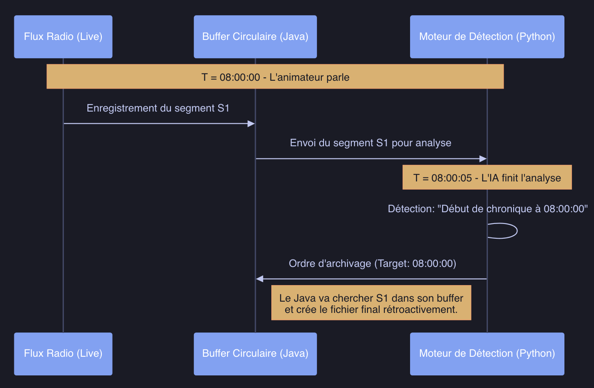

# Time Synchronization and Recalibration: The Challenge of Continuous Audio Streaming between Chronicle Segmenter and Recorder

The **RLAC (Real-time Live Audio Chronicle)** system from GroovyMorning relies on a distributed architecture where two environments collaborate: a **Java (Gradle) backend** for recording and a **Python (FastAPI) server** for artificial intelligence. Maintaining perfect synchronization to the second on a stream running 24/7 is the primary challenge.

## The "Master & Subscribers" Architecture

The heart of the recording system (located in `1.RLAC-AudioRecorder`) is based on a master stream approach:
- **Continuous Recording**: A single FFmpeg process captures the radio stream and cuts it into **1-second** HLS segments (.fMP4).
- **Temporal Reference**: At startup, the precise system time is captured (`continuousStartTime`). Each segment `N` is thus virtually timestamped: `T = StartTime + N`.

## The Problem of Detection Latency

When a chronicle capture task listens to the stream, it receives start and end notifications from the AI (the Python server). However, several seconds can elapse between the actual start of the chronicle and its confirmation by the AI (transcription latency, LLM analysis, etc.).

## The Solution: Recalibration and Hard Links

To resolve this offset, a **retroactive correction** strategy is employed:

1.  **Hard Linking**: To avoid costly file copies, hard links are created between the "Master" segments and the specific folder for the chronicle.
2.  **Accumulation**: As soon as a chronicle start is suspected, the system accumulates segments.
3.  **Post-hoc Truncation**: Once the end signal is sent by the AI with the exact `realDuration`, the actual end time is recalculated by the Java server. Excess segments, linked by mistake due to latency, are then instantly deleted.

## Advantages of the Method

- **Surgical Precision**: Cutting occurs to the second, even with an AI confirmation delay of 15 seconds.
- **Performance**: Using Hard Links allows creating a 10-minute chronicle in 0ms, with no additional disk space consumption.
- **Continuity**: Since the master stream is continuous, no data loss occurs between two successive chronicles.

This recalibration mechanism is the key element that transforms sometimes imprecise or late AI detection into a perfectly segmented audio file for the end user.
