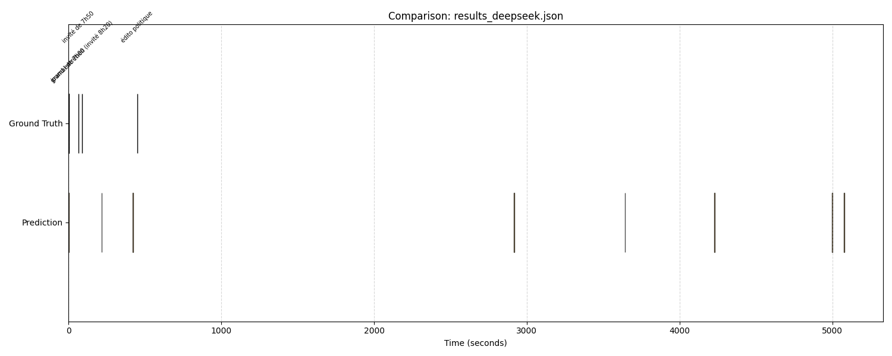

# Radio AI Benchmarking: How to Measure the Efficiency of a Segmentation Algorithm?

Evaluating an AI's understanding of radio requires a rigorous framework. This framework was established to compare different segmentation methods (LLM vs. Machine Learning vs. Audio).

## The Entry Point: The JSON Results File

Before performance analysis, each detection model must produce a results file in a standardized JSON format. This file serves as an interface contract between the AI engines and the evaluator. It lists detected chronicles with the following properties:

```json
[
  {
    "label": "The 7am News",
    "start": 120.5,           // Start of the chronicle (in seconds)
    "end": 240.0,             // End of the chronicle (in seconds)
    "detected_at": 135.2,     // Precise moment of AI confirmation
    "confidence": 0.95        // Model confidence index
  }
]
```

The evaluator then compares this file to a **Ground Truth**, containing actual timestamps validated by a human, to calculate precision and latency scores.

## The Two Pillars of Performance

Evaluating an algorithm is not limited to simple chronicle detection. Two critical dimensions are measured:

### 1. Temporal Fidelity (IoU)
The **IoU (Intersection over Union)** metric is used. It mathematically measures the overlap between the AI's prediction and the "Ground Truth" established by a human.
- An IoU of 1.0 corresponds to an exact match between detection and reality.
- A segmentation is considered too imprecise if the IoU is below 0.5.

### 2. Latency (Responsiveness)
For a live application, responsiveness is crucial. The delay between the actual start of the chronicle and the emission of the confirmation notification by the AI is therefore measured.

## The Score out of 100

Models are ranked using a weighted formula:
- **60% of the score** is based on IoU (segmentation precision).
- **40% of the score** is based on latency (speed).

Bonus points are awarded for a reaction in less than 5 seconds, while a delay exceeding 60 seconds cancels the "latency" component of the score.

## "Label-Agnostic" Mode

An "Agnostic" option allows checking if the system detects a change on air, even if the chronicle name identification is wrong. A detection is validated if it temporally corresponds to a real chronicle, regardless of its label. This mode is particularly suitable for testing silence detection algorithms or generic jingles.

## Visualization of Results

A visual diagnostic module allows visualizing the performance of radio chronicle detection models.

### Main Goal
It transforms complex data files (JSON/TXT) into a timeline, allowing at-a-glance comparison of the actual location of chronicles versus model detections.

### Visual Functioning
* Ground Truth Line: Displays thin colored vertical bars marking exactly the start of each expected chronicle.
* Prediction Line: Displays orange blocks representing the full duration detected by your model.



## Results and Observations

Using this testbed has allowed observing certain trade-offs:
- **LLMs (like DeepSeek)** offer excellent IoU (> 0.9) thanks to fine context understanding, at the cost of sometimes high latency (15-20 s).
- **Lightweight Audio models** are almost instantaneous (< 2 s) but can be misled by advertisements or unusual show structures.

This framework allows guiding GroovyMorning development through data, by selecting the most suitable model for each use case.

[French version](../fr/3.evaluation-qualite.md)
