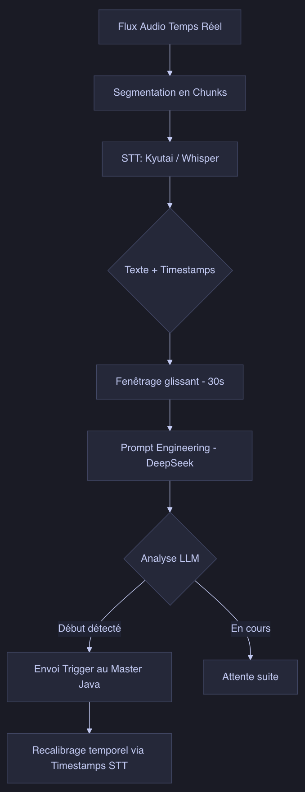

# Transcription and Semantic Analysis: The Chosen Solution

Isolating a radio chronicle goes beyond simple signal detection. On stations like France Inter, transitions are organic, and jingles are sometimes absent or masked by the host's voice. Using a natural language processing (NLP) pipeline allows GroovyMorning to achieve high precision.

## The Transcription Pipeline

The first step involves transforming audio into text. The approach used is **Kyutai (Moshi)**, optimized for low latency on Apple Silicon, enabling real-time transcription.

The audio stream is divided into chunks and sent to the STT (Speech-To-Text) model, which provides the text along with timestamps for each word.

## Semantic Analysis with DeepSeek

Once the text is obtained, identifying the start of a chronicle, such as "The Geopolitics Column," requires more than just a keyword. The **DeepSeek** LLM (Large Language Model) is then called upon.

A text window (corresponding to the last 30 seconds) is sent to the model with a specific prompt:
> "You are an expert radio assistant. Analyze this transcription and determine if a chronicle is starting, ending, or if we are in the middle. Identify the name of the chronicle if possible."  
Accompanied by a few examples of chronicle opening lines and the complete list of scheduled chronicles for the show.

The AI is able to understand the context:
*   *Host:* "It's 8:17 am, time to catch up with Pierre Haski..." -> **START DETECTED**.
*   *Journalist:* "Thank you Pierre, we'll see you tomorrow." -> **END DETECTED**.

Once the LLM detects a chronicle start in the stream, it notifies the recording module via HTTP of the chronicle's beginning.

## Temporal Recalibration
The processing time required by the AI (inference latency) is taken into account. If a chronicle start is detected at 08:15:10, the text might have been received at 08:15:15.
Using transcription metadata allows going back precisely to the moment the first word was spoken, enabling the Java capture module to start the archive at that exact moment in the buffer's past.

## Conclusion
The combination of Speech-To-Text and the contextual intelligence of LLMs transforms a raw audio stream into a structured database. GroovyMorning thus evolves from a simple capture tool into a smart personal assistant.

[French version](../fr/5.solution-retenue-transcription-analyse-semantique.md)
