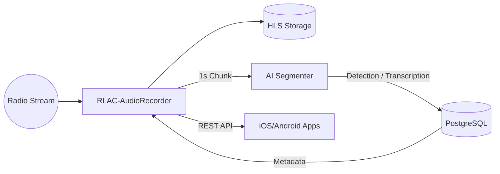

# Global Architecture: From Radio Signal to Mobile Application

The **GroovyMorning** (GMFM) project was born from a simple need: to never miss favorite radio chronicles and be able to listen to them on demand, without ads, with an experience close to a podcast, but for live content.

To transform a continuous radio stream into a library of segmented and indexed chronicles, a robust and distributed architecture was implemented.

## Pipeline Overview

The system relies on four main pillars working in harmony:

1.  **Capture (Java)**: A "Master" service that listens to the radio 24/7, creates a continuous buffer, and manages audio file writing to disk.
2.  **Intelligence (Python)**: An analysis engine that "listens" to the stream in parallel to detect jingles and transcribe text in real-time.
3.  **Orchestration (Database & API)**: A central pivot linking AI detections with recording commands.
4.  **Consumption (Mobile)**: Android and iOS applications that allow scheduling listens and playing files via the HLS protocol.

## Logical Flow Diagram

## Technological Challenges

### 1. Temporal Synchronization
The biggest challenge is offset (latency). Between the moment the sound leaves the stream and the moment the AI processes the information, several seconds elapse. The architecture uses a system of relative "Timecodes" so that the final segmenting in the Java buffer is surgical, regardless of the AI's calculation time.

### 2. Analysis Scalability
AI analysis (Whisper/Kyutai transcription and DeepSeek LLM analysis) is resource-intensive. By separating the capture service (lightweight, in Java) from the analysis service (heavyweight, in Python), the AI can be moved to a GPU-equipped machine without interrupting recording.

### 3. Mobile Robustness
Thanks to the **HLS (HTTP Live Streaming)** format, a smooth experience is offered even on unstable mobile connections. The user can start listening to a chronicle even while it is still being recorded ("chase-play" playback).

## Conclusion
This modular architecture allows GroovyMorning to be both reliable for capture and extremely flexible for evolving AI models. Each block can evolve independently, ensuring the project's long-term viability.
