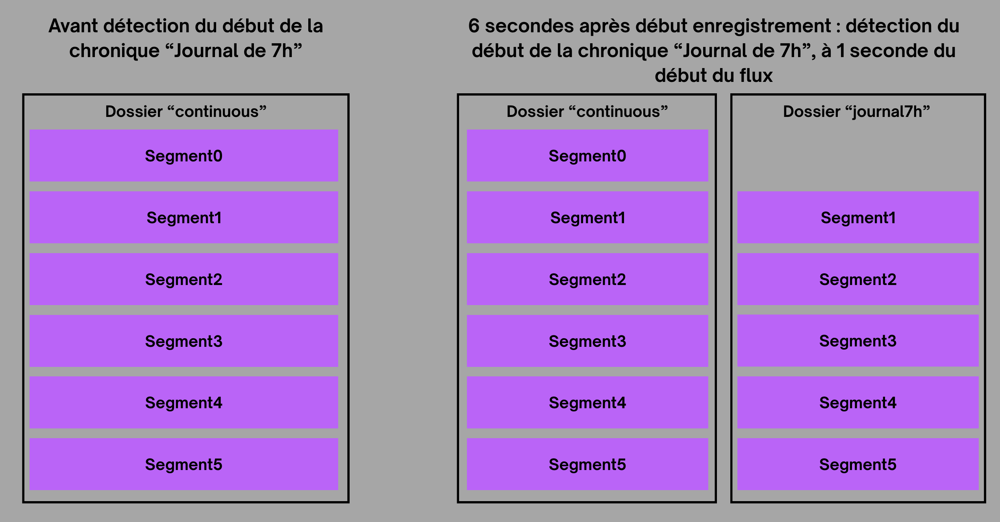

# High Availability Audio Capture

In the project, the `RLAC-AudioRecorder` module is the core of the system. It captures the radio stream without interruption, 24 hours a day, and transforms this raw stream into segments usable by a mobile application.

## Why Java for Capture?

While Python is excellent for AI, Java (via Spring Boot) was preferred for the capture part for several reasons:
*   **Thread Management**: Handling streams and external processes (FFmpeg) requires robust concurrency management.
*   **Stability**: The JVM offers memory management suited for processes intended to run uninterrupted.
*   **Ecosystem**: Integration with schedulers (Quartz) and databases is mature and performant.

## The Concept of "Master Stream" and "Dynamic Recording"

Rather than starting a recording at the precise moment a chronicle begins (which risks missing the first few seconds due to connection latency), a two-stage system was implemented.

### 1. The Master Stream (Continuous)
A permanent FFmpeg process runs continuously. It generates 1-second **fMP4** segments. This rolling buffer allows the AI to analyze the near past and the system to "go back in time" to capture the exact start of a chronicle.

### 2. Dynamic Recording
When a "START" notification is issued by the AI engine, the Java server does not start a new recording. It begins creating links (hard links or symlinks) or copying segments already generated by the Master Stream to a folder specific to the chronicle. This is the **Dynamic Recording** principle.



## Mastering FFmpeg via Java

FFmpeg control is handled via `ProcessBuilder`. Standard output is monitored to detect stream errors (internet connection loss, bitrate changes) and automatically restart the process if necessary.

```java
// Simplified process monitoring example
ProcessBuilder pb = new ProcessBuilder("ffmpeg", "-i", streamUrl, ...);
Process process = pb.start();
// Active surveillance in a separate thread
```

## Error Handling and Robustness

To ensure high availability, several mechanisms were put in place:
*   **Safety Timeouts**: If no chronicle end notification is received (in case of an AI bug), a safety timeout stops the recording to avoid disk saturation.
*   **Auto-reconnect**: In case of a network outage, the system attempts exponential reconnections.
*   **Automatic Cleaning**: A maintenance service deletes Master Stream segments older than one hour, keeping only items archived as a "chronicle."

## Result
This system achieves high capture reliability. Even if the AI service is momentarily unavailable, the continuous stream remains active, allowing post-hoc analysis to recover missing segments.
