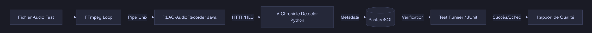

# End-to-End (E2E) Tests: Simulating Radio to Validate the Pipeline

Developing a system that combines Java, Python, FFmpeg, databases, and AI models requires particular attention to stability. To ensure that changes do not impact overall functioning, a **Simulation** environment has been set up.

## Test Philosophy in GroovyMorning

Unit tests, while necessary, are insufficient to validate a chronicle's "lifecycle chain." An **End-to-End (E2E)** test environment, completely isolated under Docker, was therefore created.

## Simulating Live Radio

The major challenge lies in the "Live" aspect. Waiting for an actual broadcast on France Inter to test the code is avoided by using a reference audio file (`test_flux.wav`). This file contains:
1.  Periods of silence.
2.  An actual jingle.
3.  A spoken sequence.
4.  An ending jingle.

This file is injected into the system via a **Unix pipe** (`/tmp/audio_pipe`), simulating live radio stream behavior for the services.

## Orchestration with Docker Compose

A complete infrastructure is deployed in seconds for each test execution:
*   **Postgres**: Storage for test schedules.
*   **GMFM-Recorder (Java)**: Capture testing.
*   **GMFM-Segmenter (Python)**: AI testing.
*   **Test Runner (Python)**: Overall coordination.

## Test Scenario

The `test_runner.py` script performs the following steps:
1.  **Initialization**: Injecting a mock schedule into the database.
2.  **Injection**: Starting playback of the `test_flux.wav` audio file.
3.  **Monitoring**: Regularly querying the Java API to detect the appearance of a new chronicle.
4.  **Validation**: Verifying the generation of the `.m3u8` file on disk and that its duration matches the injected data.

## Pipeline Benefits

This test pipeline allows for:
*   **Validating Regressions**: Ensuring optimizations do not hinder communication between components.
*   **Testing Edge Cases**: Verifying behavior during connection drops or slight jingle modifications.
*   **Cloud Independence**: Local execution avoids API fees (like DeepSeek) for frequent tests, thanks to the use of mocks or lightweight local models.

## Conclusion

The simulation approach secures GroovyMorning's deployment. Every change is validated by a real radio simulation, ensuring chronicle availability for the end user.

***

*Version française : [Tests End-to-End (E2E) : Simuler une radio pour valider le pipeline](../fr/8.tests-e2e-simulation.md)*
