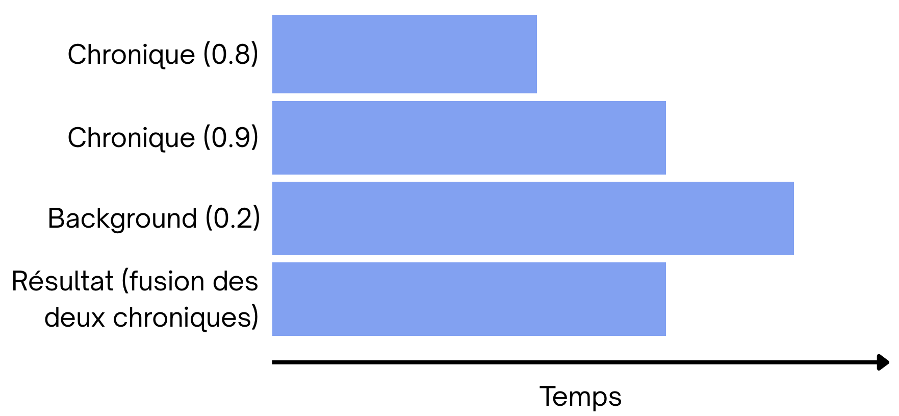
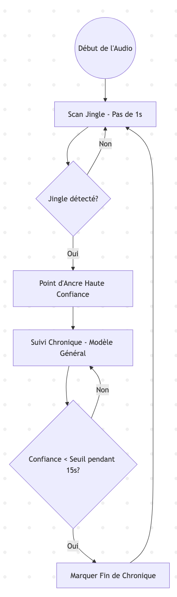

# The Journey of Training Audio Models for Chronicle Detection

This article traces the **technical evolution** and the **steps** followed to **train models** capable of **automatically detecting radio chronicles** within a full broadcast.

# Chronicle Detection from Radio Broadcast Audio

## Audio Machine Learning

This approach involves using **Machine Learning techniques** by **segmenting long audio files**, extracting **acoustic features**, and training a classifier to **identify areas of interest**.

In this new approach, we train a model with:
- files containing **no chronicles**
- files containing **only chronicles**.

### Technical Approach
The default model used is a *Random Forest*.

Instead of entrusting the decision to a single algorithm, the Random Forest creates a **hundred Decision Trees** (hence the name "Forest").
- Each tree examines the **audio features** of a segment (MFCC, energy, frequency, etc.).
- Each tree **gives its opinion**: "It's a chronicle" or "It's not a chronicle."
- The final result is the one that received the most votes (**majority** wins).

To ensure that the trees are **not all identical**, **randomness** is introduced in two ways:
- On the **data**: Each tree is trained on a **different sample** of the audio files.
- On the **criteria**: Each tree only looks at **part of the features** (for example, one tree might focus on **rhythm**, another on **low frequencies**). This prevents the algorithm from becoming "obsessed" with **a single misleading detail**.

### Extracted Audio Features
For each *3-second* segment, the system extracts a **rich acoustic signature**:
- MFCC (Mel-Frequency Cepstral Coefficients): Captures the **timbre** of the voice.
- Energy per band: Analyzes the **frequency distribution**.
- Zero-Crossing Rate: Detects the presence of **percussion** or **noise**.
- RMS (Root Mean Square): Measures **sound intensity**.
- Spectral Features: Centroid, Rolloff, and Bandwidth to analyze the **"brightness"** of the sound (the proportion and importance of **high frequencies** perceived in a sound).

> The model scores *7.69/100* (which is not sufficient), so we switch methods to start from a pre-trained model (to benefit from a model trained on a **much larger dataset**).

## Fine-tuning Wav2Vec2

This approach involves **fine-tuning** (taking a model **already trained** on a large volume of data and **continuing to train it** on a **more specific dataset**) a `wav2vec2-large-xlsr-53-french` model for **audio segment classification** (radio chronicle detection) and performing **predictions** on new audio files.

### Technical Approach
**Training**
1. **Chronicle Extraction**: Audio files are **cut into chronicles** according to the provided timecodes.
2. **Preprocessing**: Segments are **sampled** at 16,000 Hz and normalized.
3. **Fine-tuning**: The `Wav2Vec2ForSequenceClassification` model transforms an audio signal into a **sequence of numerical vectors** that capture rich sound representations. We then add a **layer** (classification head) that takes these **representations** and **transforms** them into a **score per possible category** (chronicle or background).

**Prediction**   
- Use of a **sliding window** (default 10s with 5s overlap).
- **Prediction** of the **label** for each window.
- **Merging** of **consecutive windows** having the **same label** to produce coherent segments.

### Parameter Adaptation
To try to correctly **detect** the **chronicles**, the **values of the following parameters** were **modified**:
- Confidence Threshold: The **confidence threshold** above which a result is **taken into account**.
- Minimum Duration: If the model fragments a chronicle into **several small pieces** whose duration is **less** than the **minimum duration without being merged**, they are all **deleted**.
- Merge Logic (Gap Filling): Logic consisting of **filling holes** of less than 3-5 seconds **between two detected chronicles** (otherwise, if **two segments of the same chronicle** are separated by a **short segment of "background"** (noise, jingle), they are **not merged**). 

Even when adjusting these various parameters, **no satisfactory results** were obtained during inference.

#### Dataset Balancing
One of the **issues** causing chronicles to **not be detected correctly** is the **imbalance in the dataset**: there are many **more "chronicles" than "background"** in a radio broadcast, which creates **false positives**.

The most precise method is the **percentage lever**. The script generates the data and then performs an automatic **downsampling** to reach the **exact requested ratio**.

- **Principle**: If 80% is requested, the script will calculate **how many segments of each class** to keep so that the background represents **exactly 80% of the total**.

#### Binary Detection (chronicle or not)
To **simplify** and **improve** chronicle detection, we ask the model to detect only the **periods where there are chronicles** (**without naming them**).

> After applying all these techniques, we obtain a score of *38.09*, which is also **not sufficient**.

### Robust Prediction

#### 1. Initial Problem  
The **original** inference **script** took **independent decisions per time window**. If **a single window in the middle of a chronicle** got a confidence score **slightly below the threshold**, the chronicle was **cut in two** or ignored.

#### 2. Technical Improvements
**A. Smoothing by Competitive Score (Soft Voting)**  
Instead of simply taking the **probability** of the **"chronicle"** class, the script calculates a **weighted score**:
- If `prob_chronique > prob_background`, the score is equal to `prob_chronique`.
- If `prob_background >= prob_chronique`, the chronicle score is **divided by two**.  
This forces the score to **drop drastically** as soon as the model begins to **lean towards background noise**, creating **clear separations** between two chronicles.

**B. Hysteresis Thresholding (Double Threshold)**  
Using a single threshold creates **oscillations**. We now use **two thresholds**:   
- Activation Threshold (`threshold_start`): A **high score** (0.7) is required to **trigger the start of a chronicle**.
- Hold Threshold (`threshold_end`): A **lower score** (0.3) is sufficient to **continue detection**.

> Unfortunately, the final score of the model is *8.6/100*, which is **insufficient**.

### Smooth Prediction
This simplified version focuses solely on **temporal smoothing** via a **moving average** to stabilize detections without using the complexity of hysteresis or competitive scoring.

### Principle of Smoothing (Moving Average)
In classic prediction, each window is treated **independently**. If the model has a **micro-hesitation**, the chronicle is **cut**.  

*The smooth approach* works like this:
- It retrieves the **probability** of the **chronicle class** for each window.
- It applies a **moving average** to these **probabilities** (instead of looking at the probability of an **isolated audio window** to decide if it's a chronicle, we look at the **average of that window** and the **surrounding windows**).
- A decision is made on the **smoothed value** relative to a **single threshold**.

> The score obtained by this method is *0.0/100*.

### Hybrid Approach: Detection by Jingles
This approach aims to solve **precision problems** at the **start of a chronicle** by using **introductory jingles** as high-confidence **anchor points**.

#### Concept
Rather than trying to classify each 10-second segment as **"chronicle"** or **"background"** with a single model, which often creates **ambiguities at the boundaries**, the hybrid approach divides the problem into two steps:
- Jingle Detection: Search for the **short and specific sound motif** that announces the **start of a chronicle**.
- Chronicle Extension: Once the start is "anchored" by a jingle, use the **general chronicle model** to follow the speech until its **natural end**.

#### Jingle Model Training
The training script creates a **binary model** (Jingle vs. Background) optimized for acoustic signatures. 

**Sampling Logic**

- Jingle class (Positives): The script extracts only the **first 5 seconds of each chronicle** defined in the timecodes. This is where the **musical or sound signature** of the broadcast is generally located.
- Background class (Negatives):  
  - Segments of **silence** or **music** between chronicles.
  - Segments taken from the **middle of chronicles** (after the jingle). This teaches the model to **distinguish** between **"the chronicle's jingle"** and **"the chronicle's speech"**.

#### Model Used
  Uses *AST* (Audio Spectrogram Transformer) (MIT/ast-finetuned-audioset), because its ability to **analyze audio as an image** (via spectrograms) is superior for recognizing **repetitive musical patterns** like jingles. 
  
#### Hybrid Inference
This script combines **both models** for precise segmentation.

#### Algorithm
1. Scan (1s step): The script scans the audio with the **Jingle model**. Since the step is short (1s), surgical precision is obtained for the start.
2. Detection: If the **Jingle probability exceeds the threshold** (e.g., 0.8), an anchor point is created.
3. Tracking: From this point, the script switches to the **general Chronicle model**. It advances in **5s jumps** to check if the content is still a chronicle.
4. Segment End: The **end** is marked as soon as the chronicle model returns **low confidence** for an **extended duration** (default 15s).
5. Resumption: Jingle scanning resumes after the **end of the detected chronicle**.

> The score obtained by this method is *0.0/100*.

## Fine-tuning Different Models

Although the `facebook/wav2vec2-large-xlsr-53-french` model is excellent for **Automatic Speech Recognition** (ASR), it has limitations for segment classification:

- **Linguistic Bias**: Wav2Vec2 is optimized to recognize **phonemes** and **words**. However, a chronicle is often detected by its **sound texture** (jingles, background music, acoustic quality), which Wav2Vec2 may tend to ignore.
- **Heaviness vs. Task**: The `large` version (300M+ parameters) is **heavy** for simple binary or multi-class classification. This **slows down inference** and requires more data to avoid overfitting.
- **Local Analysis**: **Sequential processing** of the raw wave may lack a **"global" vision** over a 10s segment, especially for identifying complex musical patterns (jingles).

We therefore sought to use **other models** for chronicle detection based on the broadcast sound.

**Inferences**  
Chronicle timecodes (**without naming them**)

### AST Model  
**Description**: Converts audio into a **spectrogram** (image) and uses a Transformer (ViT) for analysis.   
**Advantages**: Excellent for capturing **acoustic signatures** and **jingles**.   
**Model used**: `MIT/ast-finetuned-audioset-10-10-0.4593`

**Observations and Results**   
> Model score: 2.9/100

### BEATS Model   
**Description**: One of the models for general sound classification.   
**Advantages**: Trained to capture both **speech** and **environmental/musical sounds**. Very robust to noise and sound mixtures.   
**Model used**: `microsoft/beats-base`

**Observations and Results**   
> Model score: 2.9/100

Given that the inference function has **several parameters**, we use a program that takes an **audio and the actual location of chronicles** in that audio and **tests all combinations of parameter values** to obtain this result, in order to know the **optimal parameter configuration**.  
Unfortunately, **no model** has managed to obtain a result with the **actual chronicle locations**.

## Chronicle Detection from Transcription and Audio of Radio Broadcasts

### Using Multiple Approaches

A "multi-modal" approach is used to detect the start of radio chronicles in real-time. Instead of relying on a single criterion, it merges several types of analyses to make a more robust decision.

Here are the main steps of the method:

**1. Capture and Preprocessing**   
The system retrieves the **audio stream** (either from a file or a live stream like France Inter) and cuts it into small segments (chunks) to analyze them on the fly.

**2. The "Fast Path" (Acoustic Fingerprinting)**  
Before launching heavy computations, the system checks if the audio segment **resembles a known jingle**.
- It generates a *digital fingerprint* of the sound.
- If there is a match in its **database** (e.g., the specific jingle of a show), it triggers the **detection immediately**.

**3. Parallel Sensors (Multi-Approach)**   
If it's not a known jingle, it activates **4 different sensors**:
* **Acoustic** (Novelty): It detects **abrupt changes** in the sound texture (break in rhythm, change in atmosphere).
* **Audio Events**: It searches for the **presence of music** (often used for transitions) vs. speech.
* **Diarization**: It detects if the **speaker changes** (transition from presenter to chronicler).
* **Semantic (LLM)**: The system **transcribes** the audio into text via Whisper (STT) and sends the text to a **language model** (like Llama 3) via Ollama. The IA analyzes if the **words used** resemble a chronicle introduction (e.g., "Hello everyone, today we're going to talk about...").

**4. Score Fusion**   
Each sensor gives a **score**. The system makes a **weighted average**:
- **Semantics** (IA) has the most weight (**40%**).
- The **other criteria** (acoustic, music, speaker) share the rest (**20% each**).

**5. Learning (Feedback Loop)**  
As soon as a chronicle is detected with **certainty**, the system records the **sound fingerprint** of that moment. If it was a jingle, it will recognize it even faster next time thanks to the *Fast Path*.