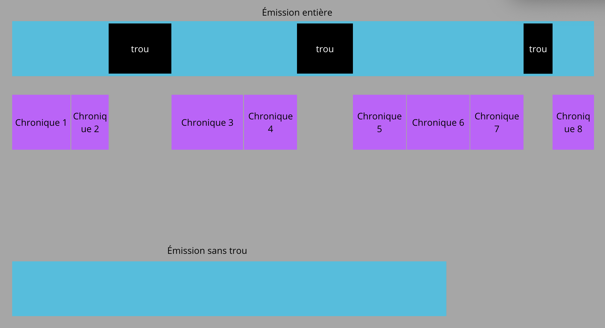

## Dataset Creation
To create the dataset, it is necessary to match radio broadcasts (transcript or audio) with the timecodes of the chronicles in each broadcast.

### Audio Data

#### Manual Download and Manual Labeling

Initially, radio broadcasts were manually downloaded from various radio websites, and chronicles were manually detected by humans, in a text file indicating the name of the chronicle as well as the start and end timecodes.

#### Manual Download, Labeling via LLM, and Human Verification
The entirely human-based chronicle detection was later replaced by detection via an LLM (gemini cli), which created the text files with the chronicle timecodes.  
Human verification was then applied through a Swift macOS interface.

*Visualization of the beginning and ending phrases of the chronicle*

*Manual editing of the beginning and ending phrases*

#### Automatic Download and Detection
The technique currently used is 100% automatic and requires no human intervention.
- **Broadcast Download**: The download of broadcasts and their constituent chronicles is entirely automated by a Python program. However, the program fails to retrieve some chronicles, so not all chronicles are downloaded.
- **Chronicle Detection**: A second program analyzes the full audio and finds the chronicles within it to deduce their position and create the text file providing the chronicle locations in the audio.
- **Audio File Adjustment**: Since some chronicles are missing, they should not be labeled as 'non-chronicle'. A third program deduces the list of missing chronicles from the theoretical list of chronicles present in the broadcast, removes the parts with missing chronicles from the audio, and adjusts the text file accordingly, taking into account the new audio and the missing chronicles.

[Version Française](../../../fr/ia-models-training/audio/ARTICLE_DATA_CREATION_AUDIO.md)
