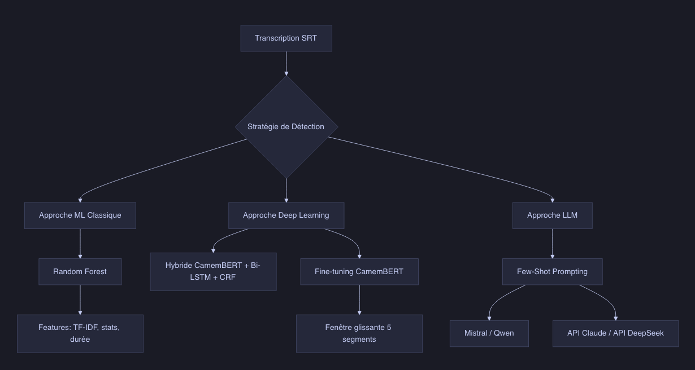
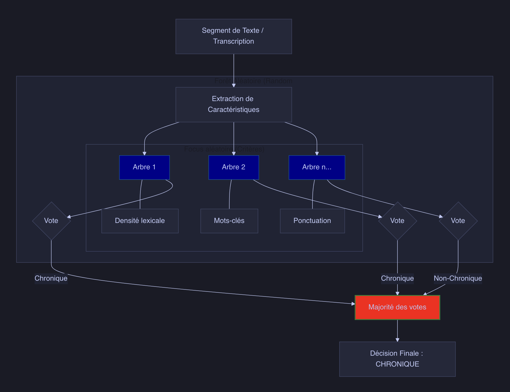
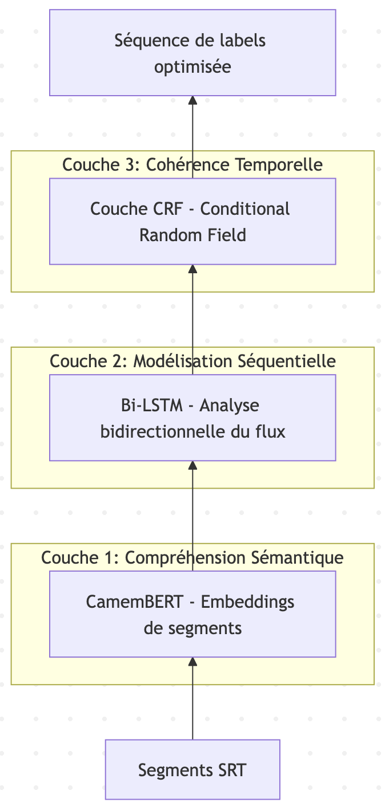

# Training Text Models

To detect **chronicles in radio broadcasts**, we use a **semantic** approach by exploiting the **transcription** of **broadcasts** and **chronicles**.

## Global Overview of Trials

## Transcription and Isolation of Chronicles via LLM

This approach relies on the **semantic intelligence** of language models (**LLM**) to identify chronicles from the transcribed text.

### Technical Approach

The approach uses a **Few-Shot Prompting** technique (learning from examples):
1.  Data Extraction: A script loads several **transcriptions** in **SRT** format (**time-stamped text**) which serve as *ground truth*.
2.  Prompt Construction: A **massive prompt** is built containing:
    - The **transcription** of the file to analyze
    - A **series of examples from past broadcasts** with their full transcriptions and the **exact timecodes of their chronicles**
3.  Inference: The model (defaulting to `mistral` via Ollama) **analyzes** these examples to **understand** the **recurring structure of the broadcast** (jingles, introductions, transitions) and applies this **logic** to the new file to **extract chronicle names** and their **timecodes**.

### Observations and Results
> Model score: 0.00/100

## Training Random Forest Model to Detect Chronicles via Transcription

This approach relies on a **chronicle detection** method using a **Random Forest** algorithm.   

### How Random Forest Works
Instead of entrusting the decision to **a single algorithm**, the Random Forest creates a **hundred Decision Trees** (hence the name "Forest").

Each tree examines the **textual features** from the **transcription of a segment** (lexical density, punctuation, sentence length, etc.).  
Each tree gives its **opinion**: "It's a chronicle" or "It's not a chronicle."  
The **final result** is the one that received the most votes (**majority** wins).

To ensure that the **trees are not all identical**, **randomness** is introduced in two ways:
- On the data: Each tree is trained on a **different sample of the text segments**.
- On the criteria: Each tree only looks at **part of the features** (for example, one tree might focus on punctuation, another on vocabulary).   
  This prevents the algorithm from becoming "obsessed" with a **single misleading detail**.

### Technical Approach
The model analyzes the transcription stream **segment by segment** using:

1.  Feature Extraction:
    - Segment duration and **temporal metadata**.
    - **Textual statistics** (word count, punctuation).
    - TF-IDF: Analysis of **word importance** to identify vocabulary specific to chronicles.

2.  Sliding Window (Contextual Window):   
    For each segment, the model takes into account the **features of adjacent segments** (local context) to improve **detection accuracy**.

3.  Classification:   
    A robust Random Forest classifier that **separates** **chronicles** from the rest of the broadcast.

### Observations and Results 
> Model score: 0.00/100

## Training a Hybrid Model (Random Forest Fine-tuned BERT)

This approach relies on an advanced radio chronicle detection method based on a **Hybrid Deep Learning** architecture analyzing textual transcriptions (SRT).  
This approach is designed to capture both the **deep meaning of speech** and the **sequential structure** of a radio broadcast.

### Technical Approach
The model is based on a **three-tier** architecture:

1.  Semantic Understanding (CamemBERT):
    Each text segment is transformed into rich characteristic **vectors** (embeddings) by the **CamemBERT language model**, allowing for an understanding of the **context** and the **topic discussed**.

2.  Sequential Modeling (Bi-LSTM):
    A **bidirectional recurrent neural network** analyzes the sequence of segments to understand the progression of the broadcast (**the link between segments**) and **identify transitions**.

3.  Temporal Consistency (CRF):
    A **Conditional Random Field** layer ensures that the predicted label sequence is **logically possible** (for example, eliminating chronicles that would last 2 seconds).

### Observations and Results 
> Model score: 29.61

## Fine-tuning the Semantic BERT Model

This approach relies on using a **CamemBERT model** (BERT for French) to detect chronicles in radio broadcast transcriptions.

### Technical Approach
Chronicle detection relies on a *Transformer* architecture (CamemBERT) specialized in **sequence classification**. The approach breaks down into **three major steps**:  

**1. Semantic Augmentation (Context)**  
An **isolated** transcription segment (often very short, e.g., 2-3 seconds) rarely contains enough information to be classified with certainty.  
- The system uses a **sliding window** (default 5 segments: the target segment + 2 before + 2 after).  
- These segments are **concatenated**, with a special [SEP] token inserted to mark the separation between segments.  
- This allows the model to capture the **structure of the broadcast** (e.g., detecting a transition, a jingle, or a summary announcement).

**2. Semantic Classification**  
The contextualized text is passed through a **fine-tuned CamemBERT (or DistilCamemBERT) model**.    

Input: The **tokens of the 5 merged segments**.   
Output: A **probability (0 to 1)** that the central segment belongs to a chronicle.

The model learns to recognize not only **thematic vocabulary** but also **politeness formulas** and **typical discourse structures** of chronicle launches.

**3. Post-processing & Smoothing**  
Raw predictions can be **discontinuous** (e.g., a silent segment in the middle of a chronicle). The inference script applies **consistency filters**:  

Smoothing: Single-segment "holes" within a detection block are **automatically filled**.   
Duration Filter: Only **continuous blocks of more than 30 seconds** are kept, thus eliminating **false positives** on brief interventions or headlines.

### Observations and Results
> Model score: *2.8/100*

## Fine-tuning the Semantic BERT Model to Detect the Start of a Chronicle

This approach uses a **CamemBERT** model (via Hugging Face Transformers) to automatically detect the **start of chronicles** within radio broadcast transcriptions (STT).

### Model Training
The *train_camembert.py* script allows for training the model on our **own data**.

Data: The script retrieves .txt files containing the transcription of the **first 10 seconds of chronicles** and extracts the **first sentence** (words until the first period).  
Output: The trained model is saved in the ./camembert_chronicle_start folder.

### Inference
The script displays a **numbered list** of **sentences** identified as being **chronicle starts**.

**Improvement**   
At the time of inference, we choose to display the **first 3 sentences of the chronicle** instead of only the first sentence. We observe that detection is often made **slightly too early**.

### Observations and Results
> Model score: *28.2/100*

**Improvement 2**
- Transition Management: The model finally learns to handle the **transition from one segment to another**. We generate **mixed examples** (e.g., [Last sentence of chronicle A, Transition sentence, First sentence of chronicle B]) labeled as chronicle start.
- Length Bias Removal: All examples now consist of **exactly 3 sentences**. The model can no longer **cheat** by associating "short text" with "chronicle start."
- Data Leakage Elimination: We no longer ask the model to detect chronicles in broadcasts that were **part of its training**. The model can no longer *memorize* a transition it would find in validation in an **almost identical form**.
- Inclusion of the **full transcription of the broadcast** to integrate more *negative* examples (non-chronicle starts).

NB: Training sessions were done by **improving an already trained model** (with the first improvements); a model was not re-generated from scratch.

### Observations and Results
> Model score: *22.4/100*

## Using an LLM to Detect Just the Start of Chronicles
After discovering that Claude can **perfectly extract chronicle opening sentences**, Qwen is used to try to extract chronicle opening sentences.

### Model Training
Qwen is asked to detect sentences corresponding to the start of chronicles. It sees sentences **one by one** (as in a live stream).  
**Few-shot prompting** is used to give examples directly in the prompt (examples of chronicle opening sentences).

### Inference
The script **observes the stream** and **signals** when it detects the start of a chronicle.

> Since results were not conclusive, another LLM was tried.

## Using Claude to Detect Just the Start of Chronicles

### Model Training
The **Claude API** is called to detect sentences corresponding to the start of chronicles, providing the **list of chronicles to detect** (in order). It sees the **sentences one by one** (as in a live stream).   
**Few-shot prompting** is used to give examples directly in the prompt (examples of chronicle opening sentences).

### Inference
The script **observes the stream** and **signals** when it detects the start of a chronicle and its name.

## Using DeepSeek to Detect Just the Start of Chronicles
For **performance** and **economic** reasons, the **DeepSeek API** is used to detect chronicles in the live stream.

### Model Training
The **DeepSeek API** (*deepseek-v4-flash*) is called to detect sentences corresponding to the **start of chronicles**, providing the **list of chronicles to detect** (in order). It sees sentences **one by one** (as in a live stream).   
**Few-shot prompting** is used to give examples directly in the prompt (examples of chronicle opening sentences).

### Inference
The script **observes the stream** and **signals** when it detects the start of a chronicle and its name.

### Observations and Results  
> Model score: *67.10*

### Improvements  
To avoid **gross errors**, chronicles are compared with their **theoretical schedule**. A detected chronicle that has **already passed** is also **ignored**.

## Chronicle Detection from Transcription and Audio of Radio Broadcasts

### Using Multiple Approaches

A "multi-modal" approach is used to detect the start of radio chronicles in real-time. Instead of relying on a single criterion, it merges several types of analyses to make a more robust decision.

Here are the main steps of the method:

**1. Capture and Preprocessing**   
   The system retrieves the **audio stream** (either from a file or a live stream like France Inter) and cuts it into small segments (chunks) to analyze them on the fly.

**2. The "Fast Path" (Acoustic Fingerprinting)**  
   Before launching heavy computations, the system checks if the audio segment **resembles a known jingle**.
- It generates a *digital fingerprint* (fingerprint) of the sound.
- If there is a match in its **database** (e.g., the specific jingle of a show), it triggers **immediate detection**.

**3. Parallel Sensors (Multi-Approach)**   
   If it's not a known jingle, it activates **4 different sensors**:
* **Acoustic** (Novelty): It detects **abrupt changes** in the sound texture (rhythm break, change in atmosphere).
* **Audio Events**: It searches for the **presence of music** (often used for transitions) vs. speech.
* **Diarization**: It detects if the **speaker changes** (transition from presenter to chronicler).
* **Semantic (LLM)**: The system **transcribes** the audio into text via Whisper (STT) and sends the text to a **language model** (like Llama 3) via Ollama. The IA analyzes if the **words used** resemble a chronicle introduction (e.g., "Hello everyone, today we're going to talk about...").

**4. Score Fusion**   
   Each sensor gives a **score**. The system makes a **weighted average**:
- **Semantics** (IA) has the most weight (**40%**).
- The **other criteria** (acoustic, music, speaker) share the rest (**20% each**).

**5. Learning (Feedback Loop)**  
   As soon as a chronicle is detected with **certainty**, the system records the **sound fingerprint** of that moment. If it was a jingle, it will recognize it even faster next time thanks to the *Fast Path*.

> Model score: *0.00/100*