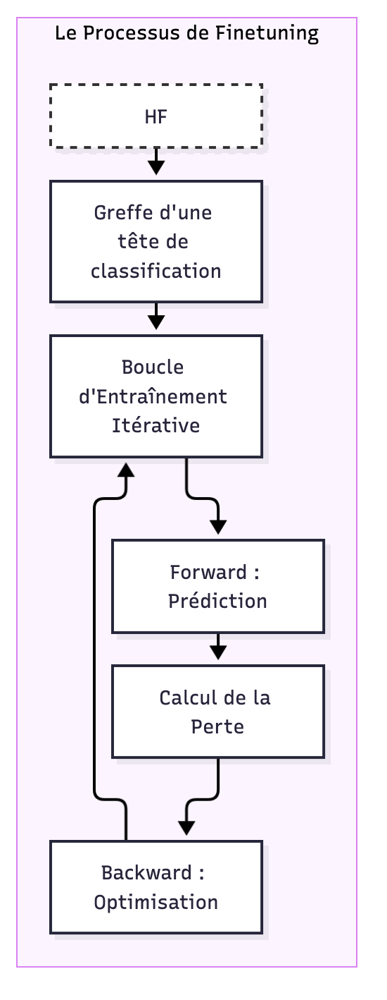

# Finetuning des Modèles d'IA

Une fois le dataset constitué et la "Ground Truth" établie, l'étape suivante consiste à entraîner et affiner (finetuner) des modèles d'intelligence artificielle capables de segmenter le flux radio avec une précision chirurgicale. Ce processus de R&D a exploré plusieurs architectures, allant du traitement du signal audio pur à l'analyse sémantique textuelle.

## La Stratégie de Finetuning

Le finetuning consiste à prendre un modèle pré-entraîné sur de vastes volumes de données (comme CamemBERT pour le texte ou Wav2Vec2 pour l'audio) et à l'adapter spécifiquement aux caractéristiques d'une émission radio (jingles, débit de parole, transitions types).

Deux axes majeurs ont été explorés :
1.  **L'approche Textuelle (NLP)** : Analyse de la transcription générée en temps réel.
2.  **L'approche Audio (Computer Vision/Signal)** : Analyse directe de l'empreinte sonore.

## Les Coulisses Techniques : Comment passer au Finetuning

Passer d'un modèle "générique" (qui comprend la langue ou le son) à un modèle "expert" (qui reconnaît vos chroniques) repose sur un pipeline industriel précis.

### 1. Le Moteur : Frameworks et Librairies
Le projet s'appuie sur l'écosystème **Hugging Face** via la bibliothèque `transformers`. C'est elle qui fournit les **classes** spécialisées comme `CamembertForSequenceClassification`. 
Sous le capot, c'est **PyTorch**, le framework de calcul tensoriel, qui gère les millions de multiplications de matrices nécessaires. Il transforme le texte en **tokens numériques** (des identifiants uniques pour chaque morceau de mot) pour que l'IA puisse "calculer" le sens plutôt que de le "lire".

### 2. L'Architecture : La Greffe de la "Tête"
Techniquement, le finetuning consiste à garder le corps du modèle pré-entraîné (qui possède déjà une connaissance encyclopédique) et à remplacer sa couche de sortie par une **tête de classification** vierge. Cette nouvelle couche est spécifiquement dimensionnée pour notre tâche (ex: 2 sorties pour une classification binaire : "Chronique" vs "Autre").

### 3. La Préparation : L'Étiquetage (Labeling)
Une règle d'or : l'étiquetage se fait **systématiquement AVANT l'entraînement**. 
C'est la phase de création de la **Ground Truth** (Vérité Terrain). Nous préparons des fichiers où chaque séquence de tokens est associée à sa réponse :
*   *Séquence A* ("Bonjour à tous...") ➔ **Label 1** (Début de chronique).
*   *Séquence B* ("Publicité...") ➔ **Label 0** (Autre).
Le modèle est comme un élève : il a besoin des questions et des corrigés pour apprendre.

### 4. La Boucle d'Entraînement : L'Apprentissage Itératif
Une fois les données prêtes, le modèle entre dans une **boucle d'entraînement** répétée plusieurs fois (les époques) :
1.  **Passage Avant (Forward)** : Le modèle devine si le segment est une chronique.
2.  **Calcul de la Perte (Loss)** : On mesure l'écart entre sa devinette et le label réel (notre corrigé).
3.  **Rétropropagation (Backward)** : Le framework identifie quels neurones sont responsables de l'erreur.
4.  **Optimisation** : On ajuste légèrement les réglages du modèle pour réduire l'erreur au tour suivant.

## Finetuning Sémantique : L'approche CamemBERT

Pour la détection basée sur le texte, nous avons utilisé **CamemBERT**, un modèle transformer spécialisé dans la langue française.

### Augmentation Sémantique par Fenêtre Glissante
Un segment isolé de 2 secondes ("Il est 8h12") est souvent insuffisant pour identifier une chronique. Nous avons implémenté une technique de **fenêtre glissante** :
*   Le modèle analyse le segment cible entouré de son contexte immédiat (2 segments avant, 2 segments après).
*   Cette vision "périphérique" permet au modèle de capter les structures de discours typiques des lancements de chroniques.

### Architecture Hybride
Pour aller plus loin, une architecture à trois étages a été testée :
*   **CamemBERT** pour les embeddings sémantiques.
*   **Bi-LSTM** pour capturer la progression séquentielle de l'émission.
*   **CRF (Conditional Random Field)** pour garantir la cohérence logique de la séquence (ex: une chronique ne peut pas se terminer avant d'avoir commencé).

## Finetuning Audio : De l'Onde au Spectrogramme

Parallèlement au texte, l'audio offre des indices précieux, notamment les jingles musicaux que la transcription ignore.

### Wav2Vec2 et AST
Nous avons expérimenté le finetuning de modèles de pointe :
*   **Wav2Vec2** : Adapté pour la classification binaire (chronique vs silence/musique).
*   **AST (Audio Spectrogram Transformer)** : Ce modèle traite l'audio comme une image via des spectrogrammes. Il s'est avéré particulièrement performant pour identifier les signatures acoustiques uniques des jingles de Radio France.

### Détection par Points d'Ancrage (Jingles)
L'une des méthodes les plus robustes consiste à utiliser un modèle léger spécialisé uniquement dans la détection des **jingles d'introduction**. Une fois le jingle détecté avec une haute confiance, le système "ancre" le début de la chronique et bascule sur un modèle de suivi de parole pour en déterminer la fin.

## Optimisation et Lissage des Prédictions

Les modèles d'IA peuvent parfois hésiter (oscillation entre "chronique" et "non-chronique"). Pour stabiliser la détection en conditions réelles, plusieurs techniques de post-traitement ont été développées :

*   **Seuil à Hystérésis** : Utilisation d'un seuil élevé pour déclencher la détection et d'un seuil plus bas pour la maintenir, évitant les coupures intempestives.
*   **Soft Voting** : Pondération des scores de confiance pour lisser les prédictions sur la durée.
*   **Gap Filling** : Comblement automatique des micro-silences ou hésitations au sein d'un bloc de détection cohérent.

## Monitoring et Itération

Chaque entraînement est monitoré via **Weights & Biases (WandB)** pour suivre l'évolution des métriques (Loss, F1-Score) et stocké sur **Hugging Face** pour être déployé. Bien que les approches par finetuning local aient montré des résultats prometteurs, c'est l'intelligence sémantique des LLM (DeepSeek/Claude) qui a finalement offert la meilleure robustesse pour la solution de production actuelle.

Le détail technique des entraînements est disponible dans [l'article dédié à l'audio](ia-models-training/audio/ARTICLE_AUDIO_TRAINING.md) et [celui dédié au texte](ia-models-training/text/ARTICLE_TEXT_TRAINING.md).
