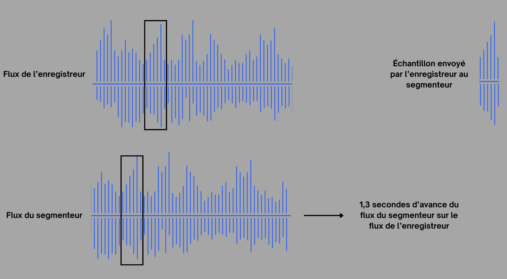

# Calcul de la latence et synchronisation Master-Slave

Dans un système distribué comme **GroovyMorning**, où l'audio capturé par un enregistreur Java est analysé par un segmenteur Python, la synchronisation constitue un défi permanent. Le mécanisme de **Master Sync** a été conçu pour assurer la correspondance exacte entre le flux Java et le segmenteur Python.

## Le problème : La dérive des flux (Stream Drift)

Plusieurs facteurs introduisent un décalage (latence) entre deux serveurs écoutant la même URL de flux radio :
- Des variations dans les délais de mise en cache HTTP.
- Le moment précis du démarrage de chaque processus `ffmpeg`.
- L'impact de la charge CPU sur la vitesse de lecture des buffers.

Sans recalibrage, un décalage de plusieurs secondes pourrait affecter l'enregistrement final lors d'une détection par l'IA.

## La solution : Le Fingerprinting Audio "On-the-fly"

Une technique d'empreinte acoustique simplifiée est utilisée pour calculer le décalage réel entre les deux instances. Le processus technique se déroule comme suit :

### 1. Génération de l'empreinte (Côté Java)
L'enregistreur Java attend l'écriture des premiers segments de l'enregistrement continu sur le disque. Dès la disponibilité du segment n° 5 (environ 5 secondes après le démarrage), une empreinte est extraite :
- **Extraction** : Conversion des segments en audio brut (PCM 16 bits) via FFmpeg.
- **Sous-échantillonnage** : Réduction de l'audio à **4000 Hz en mono** pour limiter la taille des données.
- **Résultat** : Un fichier binaire compact (`fingerprint.raw`) représentant 2 secondes de son.

### 2. La requête de synchronisation (`/api/sync_offset`)
Ce binaire est transmis par requête POST au segmenteur Python, accompagnée de l'information `positionInSeconds=5`. Cela indique au segmenteur Python l'état de l'audio côté Java à l'instant T=5s.

### 3. Calcul du Delta (Côté Python)
Un **rolling buffer** (mémoire tampon circulaire) de l'audio en cours de traitement est maintenu par le segmenteur Python. À la réception de l'empreinte :
- Une comparaison est effectuée entre l'empreinte reçue et les données du buffer.
- Le point de corrélation maximale est recherché pour identifier le décalage exact.
- **Le Delta** : Un score de confiance et un `delta` sont renvoyés. Un delta de `3,45` indique, par exemple, que le flux Java accuse un retard de 3,45 secondes sur le flux Python.

### 4. Application du recalibrage
Le `delta` reçu par l'enregistreur Java est stocké sous la variable `masterOffsetSeconds`. 
- **Correction des débuts** : Lors d'une notification "START", Java ajuste l'heure de début de l'enregistrement en intégrant ce delta.
- **Précision** : La synchronisation n'est validée qu'en cas de score de confiance élevé (> 0,7), évitant toute synchronisation erronée sur du bruit ou du silence.

## Pourquoi ne pas se limiter à l'heure système ?

Bien que l'heure système (NTP) synchronise les horloges, elle ne garantit pas la synchronisation du **contenu** des flux. Un flux radio peut présenter un retard variable dû aux serveurs de diffusion (CDN). Le fingerprinting s'avère être la seule méthode fiable pour assurer un découpage basé sur le contenu sonore réellement perçu des deux côtés.

Ce mécanisme de "Master Sync" permet à GroovyMorning d'atteindre une précision élevée dans l'extraction des chroniques.
