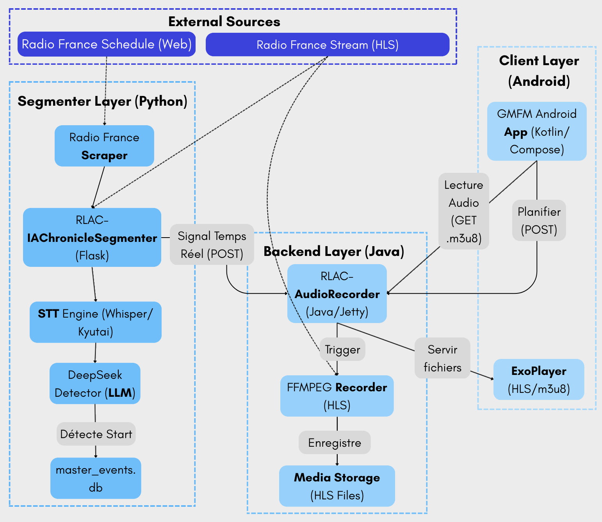
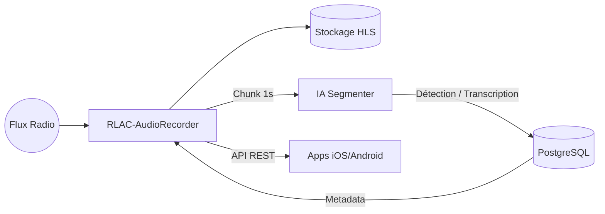

# Architecture Globale : Du Signal Radio à l'Application Mobile

Le projet **GroovyMorning** (GMFM) est né d'un besoin simple : ne plus rater ses chroniques radio préférées et pouvoir les écouter à la demande, sans les publicités, avec une expérience proche de celle d'un podcast, mais pour le direct.

Pour transformer un flux radio continu en une bibliothèque de chroniques découpées et indexées, une architecture robuste et distribuée a été mise en place.

## Vue d'ensemble du pipeline

Le système repose sur quatre piliers principaux travaillant en harmonie :

1.  **La Capture (Java)** : Un service "Master" qui écoute la radio 24h/24, crée un buffer continu et gère l'écriture des fichiers audio sur le disque.
2.  **L'Intelligence (Python)** : Un moteur d'analyse qui "écoute" le flux en parallèle pour détecter les jingles et transcrire le texte en temps réel.
3.  **L'Orchestration (Base de données & API)** : Un pivot central qui fait le lien entre les détections de l'IA et les commandes d'enregistrement.
4.  **La Consommation (Mobile)** : Des applications Android et iOS qui permettent de planifier ses écoutes et de lire les fichiers via le protocole HLS.

## Schéma logique du flux

## Les défis technologiques

### 1. La synchronisation temporelle
Le plus grand défi est le décalage (latence). Entre le moment où le son sort du flux et celui où l'IA traite l'information, plusieurs secondes s'écoulent. L'architecture utilise un système de "Timecodes" relatifs pour que le découpage final dans le buffer Java soit chirurgical, peu importe le temps de calcul de l'IA.

### 2. La scalabilité de l'analyse
L'analyse par IA (Transcription Whisper/Kyutai et analyse LLM DeepSeek) est gourmande en ressources. En séparant le service de capture (léger, en Java) du service d'analyse (lourd, en Python), l'IA peut être déportée sur une machine équipée d'un GPU sans interrompre l'enregistrement.

### 3. La robustesse mobile
Grâce au format **HLS (HTTP Live Streaming)**, une expérience fluide est offerte même sur des connexions mobiles instables. L'utilisateur peut commencer à écouter une chronique alors même qu'elle est encore en cours d'enregistrement (lecture "chase-play").

## Conclusion
Cette architecture modulaire permet à GroovyMorning d'être à la fois fiable pour la capture et extrêmement flexible pour l'évolution des modèles d'IA. Chaque brique peut évoluer indépendamment, garantissant la pérennité du projet.
