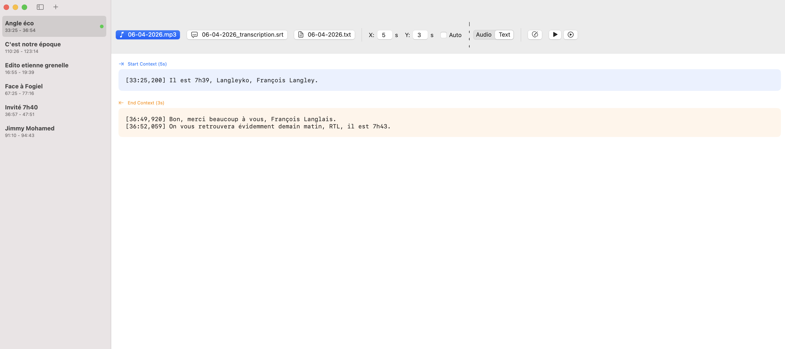

# Création de Données pour entraîner les modèles d'IA

L'intelligence artificielle dépend étroitement de la qualité des données. Pour permettre au système de détecter une chronique radio avec précision, l'apprentissage des caractéristiques sonores et textuelles des chroniques a été nécessaire, menant à la construction d'une "Ground Truth" (vérité terrain) à partir de zéro.

## Le concept de "Ground Truth"

En IA, la **Ground Truth** désigne l'ensemble de données de référence pour lesquelles la réponse exacte est connue. Dans ce contexte, cela correspond à des milliers de segments radio accompagnés de l'étiquette précise, par exemple : "Début du Billet de Géopolitique à 08:16:04".

## Le Pipeline de Création Automatisé

La récupération manuelle de ces données étant inenvisageable, une automatisation du processus a été mise en place en exploitant les archives officielles :

1.  **Scraping (Radio France API)** : Les podcasts officiels, déjà segmentés en chroniques par Radio France, sont récupérés pour servir de modèles de référence.
2.  **Alignement Temporel** : L'émission complète est téléchargée parallèlement. 
3.  **Cross-Correlation Audio** : Par une analyse mathématique du signal, les chroniques du podcast sont localisés au sein du flux live pour obtenir le timecode exact dans les conditions du direct (incluant les publicités et jingles environnants).

## De l'Audio au Texte : La Génération de Dataset

Après l'isolation des segments, différents types de données sont générés pour l'entraînement des modèles :
*   **Données Audio** : Extraction de caractéristiques (MFCC, Spectrogrammes) pour la détection de jingles.
*   **Données Textuelles** : Utilisation de **Whisper** et **kyutai** pour obtenir des transcriptions synchronisées (fichiers .srt).
*   **Étiquetage Sémantique** : Identification des phrases de transition ("Il est 8h15", "À demain Pierre") avec kyutai pour l'entraînement des modèles NLP (CamemBERT) en transcrivant les 10 premières secondes de chaque émission puis en extrayant la première phrase de cette transcription.

La génération est détaillée dans [cet article](ia-models-training/audio/ARTICLE_DATA_CREATION_AUDIO.md) pour l'audio et [cet article](ia-models-training/text/ARTICLE_TEXT_DATASET_CREATION.md) pour le texte.

## Human-in-the-loop : L'Interface de Vérification

Dans une précédente méthode, les émissions de radio entières étaient transcrites puis un LLM essayait de localiser les différentes chroniques dans l'émission.
Afin de pouvoir vérifier plus vite à la main les détections du LLM, une interface dédiée, **SegmentTimecodeVerification**, a été développée pour garantir une qualité optimale du dataset de test.

Cet outil permet une intervention humaine pour :
1.  Écouter le segment détecté par l'IA.
2.  Visualiser la transcription en parallèle.
3.  Ajuster le curseur de début/fin à la milliseconde près.
4.  Valider ou rejeter la détection.

*Visualisation de la phrase du début de la chronique et celle de fin*

*Édition manuelle de la phrase de début et de fin*

## Défis liés à la diversité

La variété du dataset a été une priorité, en incluant :
*   Différentes voix (diversité de genres, d'accents).
*   Différents moments de la journée (matinales rythmées vs émissions de nuit calmes).
*   Des cas complexes (chroniques débutant par de la musique, interviews téléphoniques).
