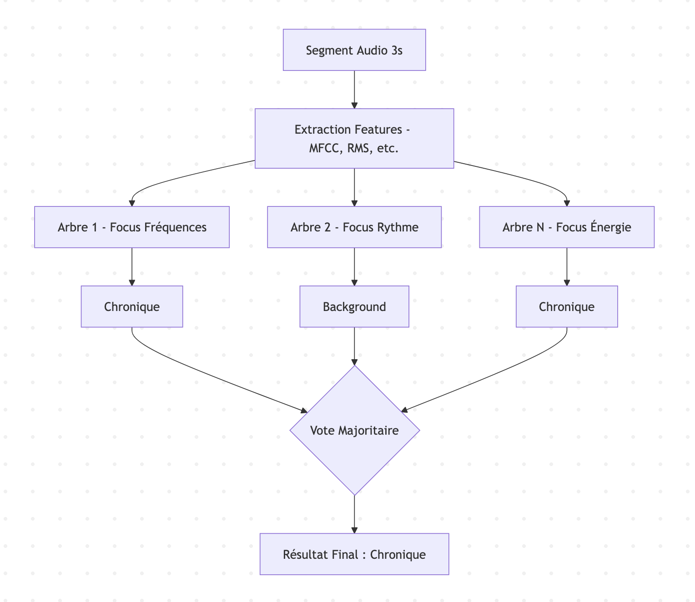
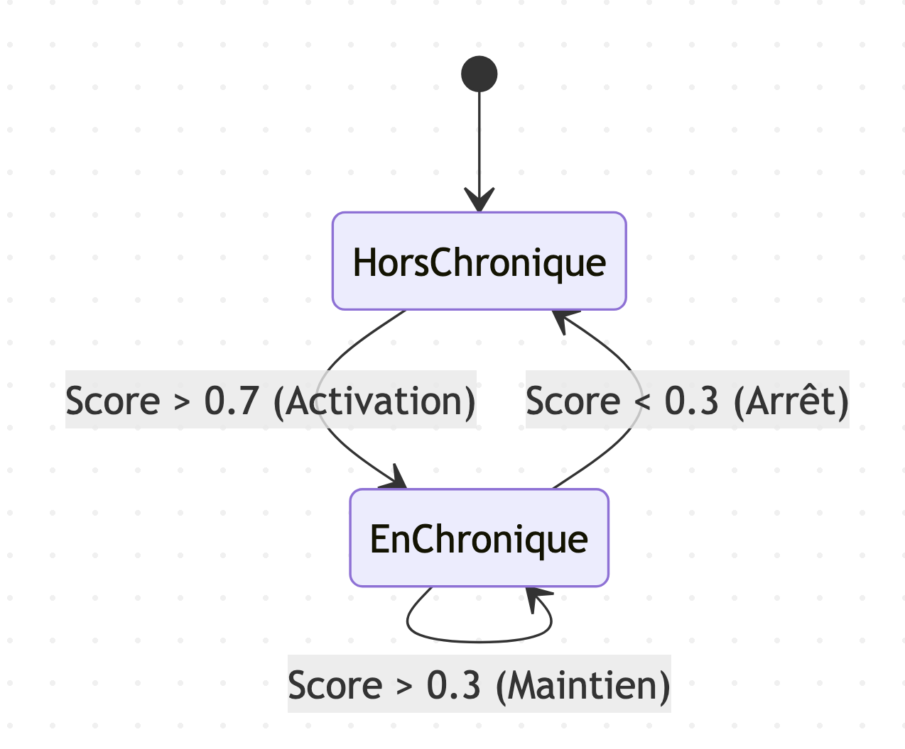

# Le Cheminement de l'Entraînement des Modèles Audio pour la Détection de Chroniques

Cet article retrace l'**évolution technique** et les **étapes** suivies pour **entraîner des modèles** capables de **détecter automatiquement des chroniques radios** au sein d'une émission complète.

# Détection de chroniques à partir des audios des émissions de radio

## Machine Learning Audio

Cette approche consiste à utiliser des **techniques d'apprentissage automatique (Machine Learning)** en **segmentant des fichiers audio longs**, extrayant des **caractéristiques acoustiques** et entraînant un classifieur pour **identifier les zones d'intérêt**.

Dans cette nouvelle approche, on entraîne un modèle avec:
- des fichiers ne contenant **pas de chroniques**
- des fichiers qui contiennent **uniquement des chroniques**.

### Approche Technique
Le modèle utilisé par défaut est un *Random Forest*.

Au lieu de confier la décision à un seul algorithme, le RandomForest crée une **centaine d'Arbres de Décision** (d'où le nom "Forêt").
- Chaque arbre examine les **caractéristiques audio** d'un segment (MFCC, énergie, fréquence, etc.).
- Chaque arbre **donne son avis** : "C'est une chronique" ou "Ce n'est pas une chronique".
- Le résultat final est celui qui a reçu le plus de votes (la **majorité** l'emporte).

Pour que les arbres ne soient **pas tous identiques**, on introduit du **hasard** de deux manières :
- Sur les **données** : Chaque arbre est entraîné sur un **échantillon différent** des fichiers audio.
- Sur les **critères** : Chaque arbre ne regarde **qu'une partie des caractéristiques** (par exemple, un arbre se focalisera sur le **rythme**, un autre sur les **fréquences graves**). Cela évite que l'algorithme ne devienne "obsédé" par **un seul détail trompeur**.

### Caractéristiques Audio Extraites
Pour chaque segment de *3 secondes*, le système extrait une **signature acoustique riche** :
- MFCC (Mel-Frequency Cepstral Coefficients) : Capture le **timbre** de la voix.
- Énergie par bande : Analyse la **répartition fréquentielle**.
- Zero-Crossing Rate : Détecte la présence de **percussions** ou de **bruits**.
- RMS (Root Mean Square) : Mesure l'**intensité sonore**.
- Caractéristiques Spectrales : Centroid, Rolloff et Bandwidth pour analyser la **"brillance"** du son (proportion et importance des **fréquences aiguës** perçues dans un son).

> Le modèle obtient la note de *7.69/100* (ce qui n'est pas suffisant), on change donc de méthode pour partir d'un modèle pré-entrainé (afin de bénificier d'un modèle entrainé sur un **dataset beaucoup plus grand**).

## Finetuning de Wav2Vec2

Cette approche consiste à **fine-tuner** (prendre un modèle **déjà entrainé** sur un gros volume de données, et **continuer de l'entraîner** sur un jeu de **données plus spécifique**) un modèle `wav2vec2-large-xlsr-53-french` pour la **classification de segments audio** (détection de chroniques radio) et d'effectuer des **prédictions** sur de nouveaux fichiers audio.

### Approche Technique
**Entraînement**
1. **Extraction des chroniques** : Les fichiers audio sont **découpés en chroniques** selon les timecodes fournis.
2. **Prétraitement** : Les segments sont **échantillonnés** à 16 000 Hz et normalisés.
3. **Fine-tuning** : Le modèle `Wav2Vec2ForSequenceClassification` transforme un signal audio en une **séquence de vecteurs numériques** qui capturent les représentations riches du son. On rajoute ensuite une **couche** (tête de classification) qui prend ces **représentations** et les **transforme** en un **score par catégorie possible** (chronique ou background).

**Prédiction**   
- Utilisation d'une **fenêtre glissante** (par défaut 10s avec 5s d'overlap).
- **Prédiction** du **label** pour chaque fenêtre.
- **Fusion** des **fenêtres consécutives** ayant le **même label** pour produire des segments cohérents.

### Adaptation des paramètres
Afin d'essayer de **détecter** correctement les **chroniques**, les **valeurs des paramètres** suivants ont été **modifiés** :
- Seuil de confiance (threshold) : Le **seuil de confiance** à partir duquel on **prend en compte** un résultat.
- Durée minimale : Si le modèle fragmente une chronique en **plusieurs petits morceaux** dont la durée est **inférieure** à la **durée minimale non fusionnés**, ils sont tous **supprimés**.
- Logique de fusion (Gap Filling) : Logique consistant à **combler les trous** de moins de 3-5 secondes **entre deux chroniques détectées** (sinon si **deux segments d'une même chronique** sont séparés par un **court segment de "background"** (bruit, jingle), ils ne sont **pas fusionnés**). 

Même en jouant sur ces différents paramètres, **aucun résultat satisfaisant** lors de l'inférence n'a été obtenu.

#### Équilibrage du jeu de données
Un des **soucis** qui fait que les chroniques ne sont **pas détectées correctement** est le **déséquilibre dans le jeu de données** : il y a beaucoup **plus de "chroniques" que de "background"** dans une radio, ce qui va créer des **faux positifs**.

La méthode la plus précise est le **levier de pourcentage**. Le script génère les données, puis effectue un **sous-échantillonnage (downsampling)** automatique pour atteindre le **ratio exact demandé**.

- **Principe** : Si on demande 80%, le script calculera **combien de segments de chaque classe** garder pour que le background représente **exactement 80% du total**.

#### Détection binaire (chronique ou non)
Afin de **simplifier** et d'**améliorer** la détection des chroniques, on demande au modèle de détecter seulement les **périodes où il y a des chroniques** (**sans les nommer**).

> Après l'application de toutes ces techniques, on obtient la note de *38.09*, ce qui n'est **pas suffisant** non plus.

### Prédiction robuste

#### 1. Problématique Initiale  
Le **script** d'inférence **d'origine** prenait des **décisions indépendantes par fenêtre de temps**. Si **une seule fenêtre au milieu d'une chronique** obtenait un score de confiance **légèrement inférieur au seuil**, la chronique était **coupée en deux** ou ignorée.

#### 2. Améliorations Techniques
**A. Lissage par Score Compétitif (Soft Voting)**  
Au lieu de simplement prendre la **probabilité** de la classe **"chronique"**, le script calcule un **score pondéré** :
- Si `prob_chronique > prob_background`, le score est égal à `prob_chronique`.
- Si `prob_background >= prob_chronique`, le score de chronique est **divisé par deux**.  
Cela force le score à **chuter drastiquement** dès que le modèle commence à **pencher vers le bruit de fond**, créant ainsi des **séparations nettes** entre deux chroniques.

**B. Seuil à Hystérésis (Double Seuil)**  
L'utilisation d'un seuil unique crée des **oscillations**. Nous utilisons désormais **deux seuils** :   
- Seuil d'Activation (`threshold_start`) : Un **score élevé** (0.7) est nécessaire pour **déclencher le début d'une chronique**.
- Seuil de Maintien (`threshold_end`) : Un **score plus bas** (0.3) suffit pour **continuer la détection**.

> Malheureusement, le score final du modèle est de *8.6/100*, ce qui est **insuffisant**.

### Prédiction lisse
Cette version simplifiée se concentre uniquement sur le **lissage temporel** par **moyenne mobile** pour stabiliser les détections sans utiliser la complexité de l'hystérésis ou du score compétitif.

### Principe du Lissage (Moving Average)
Dans une prédiction classique, chaque fenêtre est traitée **indépendamment**. Si le modèle a une **micro-hésitation**, la chronique est **coupée**.  

*L'approche lisse* fonctionne ainsi :
- Elle récupère la **probabilité** de la **classe chronique** pour chaque fenêtre.
- Elle applique une **moyenne glissante** sur ces **probabilités** (au lieu de regarder la probabilité d'une **fenêtre audio isolée** pour décider s'il s'agit d'une chronique, on regarde la **moyenne de cette fenêtre** et des **fenêtres qui l'entourent**).
- Une décision est prise sur la **valeur lissée** par rapport à un **seuil unique**.

> Le score obtenu par cette méthode est de *0.0/100*.

### Approche hybride : Détection par jingles
Cette approche vise à résoudre les **problèmes de précision** de **début de chronique** en utilisant les **jingles d'introduction** comme **points d'ancrage** de haute confiance.

#### Concept
Plutôt que d'essayer de classer chaque segment de 10 secondes comme **"chronique"** ou **"background"** avec un seul modèle, ce qui crée souvent des **ambiguïtés aux frontières**, l'approche hybride divise le problème en deux étapes :
- Détection de Jingle : Rechercher le **motif sonore court** et spécifique qui annonce le **début d'une chronique**.
- Extension de Chronique : Une fois le début "ancré" par un jingle, utiliser le **modèle de chronique général** pour suivre la parole jusqu'à sa **fin naturelle**.

#### Entraînement du modèle de jingle
Le script d'entraînement crée un **modèle binaire** (Jingle vs Background) optimisé pour les signatures acoustiques. 

**Logique d'échantillonnage**

- Classe jingle (Positifs) : Le script extrait uniquement les **5 premières secondes de chaque chronique** définie dans les timecodes. C'est là que se trouve généralement la **signature musicale** ou sonore de l'émission.
- Classe background (Négatifs) :  
  - Segments de **silence** ou **musique** entre les chroniques.
  - Segments prélevés au **milieu des chroniques** (après le jingle). Cela apprend au modèle à faire la **distinction** entre **"le jingle de la chronique"** et **"la parole de la chronique"**.

#### Modèle utilisé
  Utilise *AST* (Audio Spectrogram Transformer) (MIT/ast-finetuned-audioset), car sa capacité à **analyser l'audio comme une image** (via spectrogrammes) est supérieure pour reconnaître des **motifs musicaux répétitifs** comme les jingles. 
  
#### Inférence Hybride
Ce script combine les **deux modèles** pour une segmentation précise.

#### Algorithme
1. Scan (Pas de 1s) : Le script parcourt l'audio avec le **modèle de Jingle**. Comme le pas est court (1s), on obtient une précision chirurgicale sur le début.
2. Détection : Si la **probabilité de Jingle dépasse le seuil** (ex: 0.8), un point d'ancrage est créé.
3. Suivi (Tracking) : À partir de ce point, le script bascule sur le **modèle de Chronique général**. Il avance par **bonds de 5s** pour vérifier si le contenu est toujours une chronique.
4. Fin du segment : La **fin** est marquée dès que le modèle de chronique renvoie une **confiance faible** sur une **durée prolongée** (15s par défaut).
5. Reprise : Le scan de jingles reprend après la **fin de la chronique détectée**.

> Le score obtenu par cette méthode est de *0.0/100*.

## Finetuning de différents modèles

Bien que le modèle `facebook/wav2vec2-large-xlsr-53-french` soit excellent pour la **reconnaissance vocale** (ASR), il présente des limites pour la classification de segments :

- **Biais linguistique** : Wav2Vec2 est optimisé pour reconnaître des **phonèmes** et des **mots**. Or, une chronique se détecte souvent par sa **texture sonore** (jingles, musique de fond, qualité acoustique) que Wav2Vec2 peut avoir tendance à ignorer.
- **Lourdeur vs Tâche** : La version `large` (300M+ paramètres) est **lourde** pour une classification binaire ou multi-classes simple. Cela **ralentit l'inférence** et nécessite plus de données pour éviter le sur-apprentissage (overfitting).
- **Analyse Locale** : Le **traitement séquentiel** de l'onde brute peut manquer de **vision "globale"** sur un segment de 10s, notamment pour identifier des motifs musicaux complexes (jingles).

On a donc cherché à utiliser d'**autres modèles** pour la détection des chroniques à partir du son de l'émission.

**Inférences**  
Timecodes des chroniques (**sans les nommer**)

### Modèle AST  
**Description** : Convertit l'audio en **spectrogramme** (image) et utilise un Transformer (ViT) pour l'analyse.   
**Avantages** : Excellent pour capturer les **signatures acoustiques** et les **jingles**.   
**Modèle utilisé** : `MIT/ast-finetuned-audioset-10-10-0.4593`

**Observations et Résultats**   
> Note du modèle : 2.9/100

### Modèle BEATS   
**Description** : Un des modèles pour la classification sonore générale.   
**Avantages** : Entraîné pour capturer à la fois la **parole** et les **sons environnementaux/musicaux**. Très robuste au bruit et aux mélanges sonores.   
**Modèle utilisé** : `microsoft/beats-base`

**Observations et Résultats**   
> Note du modèle : 2.9/100

Étant donné que la fonction d'inférence présente **plusieurs paramètres**, on utilise un programme qui prend un **audio et l'emplacement réel des chroniques** dans cet audio et **teste toutes les combinaisons de valeur de paramètres** pour obtenir ce résultat, afin de connaitre la **configuration optimale des paramètres**.  
Malheureusement, **aucun modèle** n'a réussi à obtenir un résultat avec les **emplacements réels des chroniques**.

## Détection de chroniques à partir de la transcription et de l'audio des émissions de radio

### Utilisation de plusieurs approches

On utilise une approche "multi-modale" pour détecter le début de chroniques radio en temps
réel. Au lieu de se baser sur un seul critère, il fusionne plusieurs types d'analyses pour prendre une décision plus
robuste.

Voici les grandes étapes de la méthode :

**1. La Capture et le Prétraitement**   
Le système récupère le **flux audio** (soit d'un fichier, soit d'un flux live comme France Inter) et le découpe en petits
segments (chunks) pour les analyser au fil de l'eau.

**2. Le "Fast Path" (Empreintes Acoustiques)**  
Avant de lancer des calculs lourds, le système vérifie si le segment audio **ressemble à un jingle connu**.
- Il génère une *empreinte digitale* (fingerprint) du son.
- S'il y a un match dans sa **base de données** (ex: le jingle spécifique d'une émission), il déclenche la **détection
  immédiatement**.

**3. Les Capteurs Parallèles (Multi-Approche)**   
Si ce n'est pas un jingle connu, il active **4 capteurs différents** :
* **Acoustique** (Novelty) : Il détecte les **changements brusques** dans la texture sonore (rupture de rythme, changement  d'ambiance).
* **Événements Audio** : Il cherche la **présence de musique** (souvent utilisée pour les transitions) vs la parole.
* **Diarisation** : Il détecte si l'**interlocuteur change** (passage du présentateur au chroniqueur).
* **Sémantique (LLM)** : Le système **transcrit** l'audio en texte via Whisper (STT) et envoie le texte à un **modèle de langage** (type Llama 3) via Ollama. L'IA analyse si les **mots employés** ressemblent à une introduction de chronique (ex: "Bonjour à tous, aujourd'hui on va parler de...").

**4. La Fusion des Scores**   
Chaque capteur donne une **note**. Le système fait une **moyenne pondérée** :
- La **sémantique** (IA) a le plus de poids (**40%**).
- Les **autres critères** (acoustique, musique, speaker) se partagent le reste (**20% chacun**).

**5. L'Apprentissage (Boucle de rétroaction)**  
Dès qu'une chronique est détectée avec **certitude**, le système enregistre l'**empreinte sonore** de ce moment. Si c'était un
jingle, il le reconnaîtra encore plus vite la prochaine fois grâce au *Fast Path*.