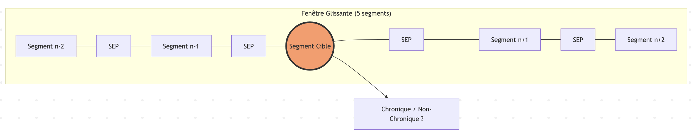
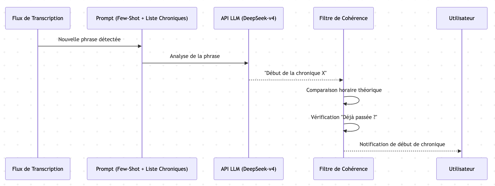
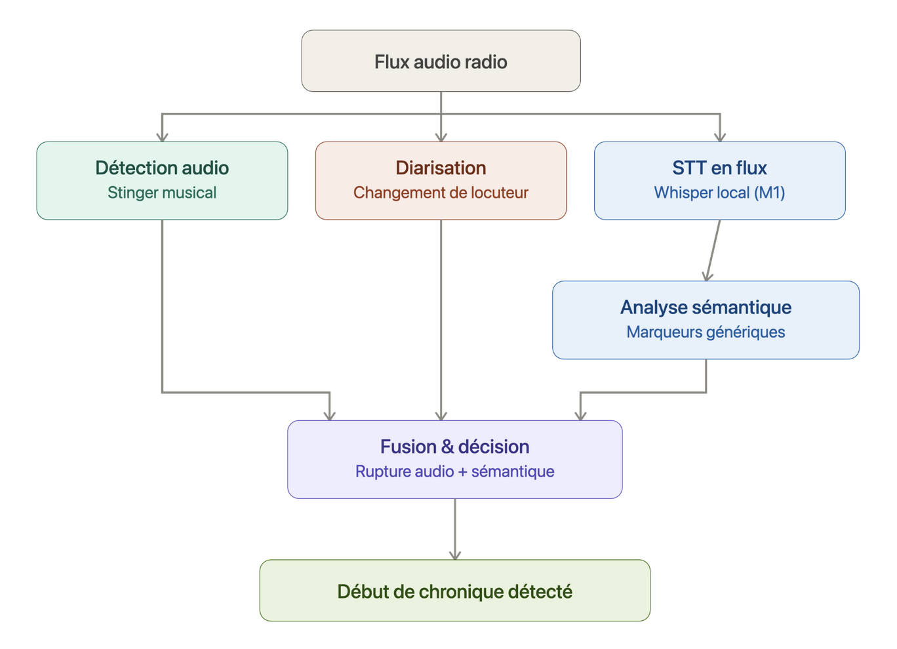

# Entrainement des modèles textuels

Afin de détecter les **chroniques dans l'émission de radio**, on utilise une approche **sémantique** en exploitant la **transcription** des **émissions** et des **chroniques**.

## Vue globale des essais

## Transcription et isolation des chroniques via LLM

Cette approche repose sur l'**intelligence sémantique** des modèles de langage (**LLM**) pour identifier les chroniques à partir du texte transcrit.

### Approche Technique

L'approche utilise une technique de **Few-Shot Prompting** (apprentissage par l'exemple) :
1.  Extraction de données : Un script charge plusieurs **transcriptions** au format **SRT** (**texte horodaté**) qui servent de *vérité terrain* (ground truth).
2.  Construction du Prompt : On construit un **prompt massif** qui contient :
    - La **transcription** du fichier à analyser
    - Une **série d'exemples d'émissions passées** avec leurs transcriptions complètes et les **timecodes exacts de leurs chroniques**
3.  Inférence : Le modèle (par défaut `mistral` via Ollama) **analyse** ces exemples pour **comprendre** la **structure récurrente de l'émission** (jingles, introductions, transitions) et applique cette **logique** au nouveau fichier pour **extraire les noms des chroniques** et leurs **timecodes**.

### Observations et Résultats
> Note du modèle : 0.00/100

## Entrainement modèle RandomForest pour détecter les chroniques via transcription

Cette approche repose sur une méthode de **détection de chroniques** radio en utilisant un algorithme **Random Forest**.   

### Fonctionnement de RandomForest
Au lieu de confier la décision à **un seul algorithme**, le RandomForest crée une **centaine d'Arbres de Décision** (d'où le nom "Forêt").

Chaque arbre examine les **caractéristiques textuelles** issues de la **transcription d'un segment** (densité lexicale, ponctuation, longueur des phrases, etc.).  
Chaque arbre donne son **avis** : "C'est une chronique" ou "Ce n'est pas une chronique".  
Le **résultat final** est celui qui a reçu le plus de votes (la **majorité** l'emporte).

Pour que les **arbres ne soient pas tous identiques**, on introduit du **hasard** de deux manières :
- Sur les données : Chaque arbre est entraîné sur un **échantillon différent des segments** de texte.
- Sur les critères : Chaque arbre ne regarde **qu'une partie des caractéristiques** (par exemple, un arbre se focalisera sur la ponctuation, un autre sur le
  vocabulaire).   
  Cela évite que l'algorithme ne devienne "obsédé" par un **seul détail trompeur**.

### Approche Technique
Le modèle analyse le flux de transcription **segment par segment** en utilisant :

1.  Extraction de caractéristiques (Features) :
    - Durée des segments et **métadonnées temporelles**.
    - **Statistiques textuelles** (nombre de mots, ponctuation).
    - TF-IDF : Analyse de l'**importance des mots** pour identifier le vocabulaire spécifique aux chroniques.

2.  Fenêtre Glissante (Contextual Window) :   
    Pour chaque segment, le modèle prend en compte les **caractéristiques des segments adjacents** (contexte local) pour améliorer la **précision de la détection**.

3.  Classification :   
    Un classifieur Random Forest robuste qui **sépare** les **chroniques** du reste de l'émission.

### Observations et Résultats 
> Note du modèle : 0.00/100

## Entrainement d'un modèle hybride (Random Forest BERT fine-tuné)

Cette approche repose sur une méthode avancée de détection de chroniques radio basée sur une architecture **Deep Learning Hybride** analysant les transcriptions textuelles (SRT).  
Cette approche est conçue pour capturer à la fois le **sens profond des paroles** et la **structure séquentielle** d'une émission radio.

### Approche Technique
Le modèle repose sur une architecture à **trois étages** :

1.  Compréhension Sémantique (CamemBERT) :
    Chaque segment de texte est transformé en **vecteurs** de caractéristiques riches (embeddings) par le **modèle de langage CamemBERT**, permettant de comprendre le **contexte** et le **sujet abordé**.

2.  Modélisation Séquentielle (Bi-LSTM) :
    Un **réseau de neurones récurrent bidirectionnel** analyse la suite des segments pour comprendre la progression de l'émission (**le lien entre les segments**) et **identifier les transitions**.

3.  Cohérence Temporelle (CRF) :
    Une couche **Conditional Random Field** garantit que la séquence de labels prédite est **logiquement possible** (par exemple, éliminer des chroniques qui dureraient 2 secondes).

### Observations et Résultats 
> Note du modèle : 29.61

## Fine-tuner le modèle sémantique BERT

Cette approche repose sur l'**utilisation d'un modèle CamemBERT** (BERT pour le français) pour détecter les chroniques dans les transcriptions d'émissions de radio.

### Approche Technique
La détection de chroniques repose sur une architecture de type *Transformer* (CamemBERT) spécialisée dans la **classification de séquences**. L'approche se décompose en **trois étapes majeures** :  

**1. Augmentation Sémantique (Contexte)**  
Un segment de transcription **isolé** (souvent très court, ex: 2-3 secondes) contient rarement assez d'information pour être classé avec certitude.  
- Le système utilise une **fenêtre glissante** (par défaut 5 segments : le segment cible + 2 avant + 2 après).  
- Ces segments sont **concaténés**, mais on insère un jeton spécial [SEP] pour marquer la séparation entre les segments.  
- Cela permet au modèle de capter la **structure de l'émission** (ex: détecter une transition, un jingle ou une annonce de sommaire).

**2. Classification Sémantique**  
Le texte contextualisé est passé dans un modèle **CamemBERT (ou DistilCamemBERT) fine-tuné**.    

Entrée : Les **tokens des 5 segments** fusionnés.   
Sortie : Une **probabilité (0 à 1)** que le segment central appartienne à une chronique.

Le modèle apprend à reconnaître non seulement le **vocabulaire thématique**, mais aussi les **formules de politesse** et les **structures de discours typiques** des lancements de chroniques.

**3. Post-traitement & Lissage**  
Les prédictions brutes peuvent être **discontinues** (ex: un segment de silence au milieu d'une chronique). Le script d'inférence applique des **filtres de cohérence** :  

Lissage (Smoothing) : Les "trous" d'un seul segment au sein d'un bloc de détection sont **automatiquement comblés**.   
Filtre de durée : Seuls les **blocs continus de plus de 30 secondes** sont conservés, éliminant ainsi les **faux positifs** sur des interventions brèves ou des titres.

### Observations et Résultats
> Note du modèle : *2.8/100*

## Fine-tuner le modèle sémantique BERT pour détecter le début d'une chronique

Cette approche utilise un modèle **CamemBERT** (via Hugging Face Transformers) pour détecter automatiquement le **début des chroniques** au sein de transcriptions d'émissions de radio (STT).

### Entraînement du modèle
Le script *train_camembert.py* permet d'entraîner le modèle sur nos **propres données**.

Données : Le script récupère des fichiers .txt contenant la transcription des **10 premières secondes des chroniques** et extrait la **première phrase** (les mots jusqu'au premier point).  
Sortie : Le modèle entraîné est sauvegardé dans le dossier ./camembert_chronicle_start.

### Inférence
Le script affiche une **liste numérotée** des **phrases** identifiées comme étant des **débuts de chronique**.

**Amélioration**   
Au moment de l'inférence, on choisit d'afficher les **3 premières phrases de la chronique** au lieu d'uniquement la première phrase de la chronique. On constate que la détection est souvent faite **légèrement trop tôt**.

### Observations et Résultats
> Note du modèle : *28.2/100*

**Amélioration 2**
- Gestion des Transitions : Le modèle apprend enfin à gérer le **passage d'un segment à l'autre**. On génère des **exemples mixtes** (ex: [Dernière phrase de la chronique A, Phrase de transition, Première phrase de la chronique B]) étiquetés comme début de chronique.
- Suppression du Biais de Longueur : Tous les exemples font désormais **exactement 3 phrases**. Le modèle ne peut plus **tricher** en associant "texte court" à "début de chronique".
- Élimination de la Fuite de Données : On ne demande plus au modèle de détecter des chroniques dans des émissions qui faisaient **parties de son entraînement**. Le modèle ne peut plus *apprendre par cœur* une transition qu'il retrouverait en validation sous une **forme presque identique**.
- Prise en compte de la **transcription complète de l'émission** pour intégrer plus de phrases *négatives* (non début de chroniques).

NB : Les entraînements ont été faits en **améliorant un modèle déjà entrainé** (avec les premières améliorations), un modèle n'a pas été re-généré de 0.

### Observations et Résultats
> Note du modèle : *22.4/100*

## Utiliser un LLM pour détecter juste le début des chroniques
Après découverte que Claude arrive à **extraire parfaitement les phrases de début de chroniques**, utilisation de Qwen pour essayer d'extraire les phrases de début de chroniques.

### Entraînement du modèle
On demande à Qwen de détecter les phrases correspond au début des chroniques. Il ne voit que les phrases **au fur et à mesure** (comme dans un flux live).  
On utilise le **few-shot prompting** pour lui donner des exemples directement dans le prompt (des exemples de phrases de début de chroniques).

### Inférence
Le script **observe le flux** et **signale** quand il détecte le début d'une chronique.

> Les résultats n'étant pas concluants, on essaie un autre LLM.

## Utiliser Claude pour détecter juste le début des chroniques

### Entraînement du modèle
On appelle l'**API de Claude** pour détecter les phrases correspond au début des chroniques, en lui donnant la **liste des chroniques à détecter** (dans l'ordre). Il ne voit que les **phrases au fur et à mesure** (comme dans un flux live).   
On utilise le **few-shot prompting** pour lui donner des exemples directement dans le prompt (des exemples de phrases de début de chroniques).

### Inférence
Le script **observe le flux** et **signale** quand il détecte le début d'une chronique et son nom.

## Utiliser DeepSeek pour détecter juste le début des chroniques
Pour des raisons de **performances** du modèle de Claude et **économiques**, on utilise l'API de **DeepSeek** pour détecter les chroniques dans le flux live.

### Entraînement du modèle
On appelle l'**API de DeepSeek** (*deepseek-v4-flash*) pour détecter les phrases correspond au **début des chroniques**, en lui donnant la **liste des chroniques à détecter** (dans l'ordre). Il ne voit que les phrases au **fur et à mesure** (comme dans un flux live).   
On utilise le **few-shot prompting** pour lui donner des exemples directement dans le prompt (des exemples de phrases de début de chroniques).

### Inférence
Le script **observe le flux** et **signale** quand il détecte le début d'une chronique et son nom.

### Observations et Résultats  
> Note du modèle : *67.10*

### Améliorations  
Afin d'éviter les **erreurs grossières**, les chroniques sont comparées avec leur **horaire théorique**. On **ignore** également une chronique détectée qui est **déjà passée**.

## Détection de chroniques à partir de la transcription et de l'audio des émissions de radio

### Utilisation de plusieurs approches

On utilise une approche "multi-modale" pour détecter le début de chroniques radio en temps
réel. Au lieu de se baser sur un seul critère, il fusionne plusieurs types d'analyses pour prendre une décision plus
robuste.

Voici les grandes étapes de la méthode :

**1. La Capture et le Prétraitement**   
   Le système récupère le **flux audio** (soit d'un fichier, soit d'un flux live comme France Inter) et le découpe en petits
   segments (chunks) pour les analyser au fil de l'eau.

**2. Le "Fast Path" (Empreintes Acoustiques)**  
   Avant de lancer des calculs lourds, le système vérifie si le segment audio **ressemble à un jingle connu**.
- Il génère une *empreinte digitale* (fingerprint) du son.
- S'il y a un match dans sa **base de données** (ex: le jingle spécifique d'une émission), il déclenche la **détection
  immédiatement**.

**3. Les Capteurs Parallèles (Multi-Approche)**   
   Si ce n'est pas un jingle connu, il active **4 capteurs différents** :
* **Acoustique** (Novelty) : Il détecte les **changements brusques** dans la texture sonore (rupture de rythme, changement  d'ambiance).
* **Événements Audio** : Il cherche la **présence de musique** (souvent utilisée pour les transitions) vs la parole.
* **Diarisation** : Il détecte si l'**interlocuteur change** (passage du présentateur au chroniqueur).
* **Sémantique (LLM)** : Le système **transcrit** l'audio en texte via Whisper (STT) et envoie le texte à un **modèle de langage** (type Llama 3) via Ollama. L'IA analyse si les **mots employés** ressemblent à une introduction de chronique (ex: "Bonjour à tous, aujourd'hui on va parler de...").

**4. La Fusion des Scores**   
   Chaque capteur donne une **note**. Le système fait une **moyenne pondérée** :
- La **sémantique** (IA) a le plus de poids (**40%**).
- Les **autres critères** (acoustique, musique, speaker) se partagent le reste (**20% chacun**).

**5. L'Apprentissage (Boucle de rétroaction)**  
   Dès qu'une chronique est détectée avec **certitude**, le système enregistre l'**empreinte sonore** de ce moment. Si c'était un
   jingle, il le reconnaîtra encore plus vite la prochaine fois grâce au *Fast Path*.

> Note du modèle : *0.00/100*